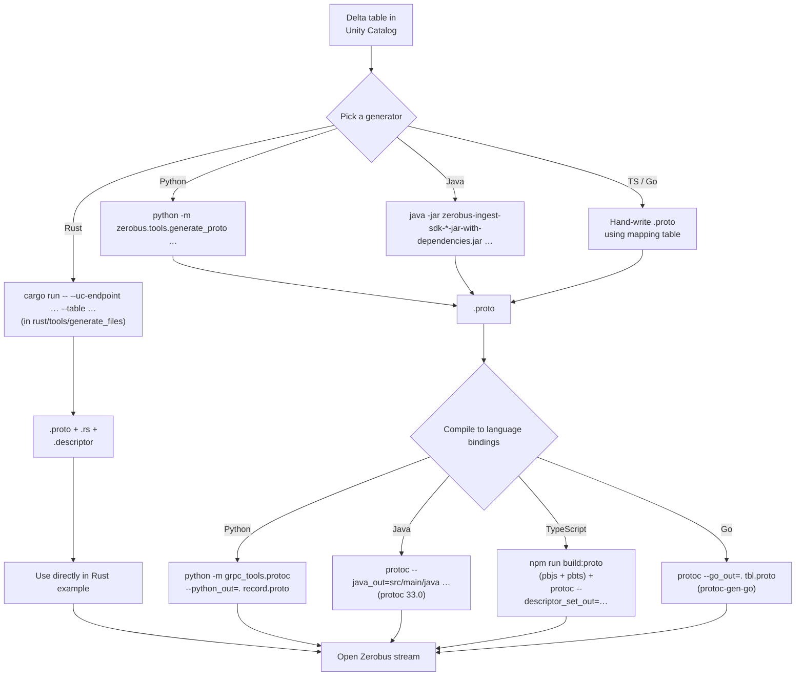

# Delta Lake Table → Protobuf: Available Tooling

> Research scope: what tools (in this repo and elsewhere) take a Delta Lake / Unity Catalog table and produce a `.proto` schema (plus, where applicable, language-native bindings and a binary `FileDescriptorSet`) usable with the Databricks Zerobus Ingest SDK.
>
> All in-repo citations point at `mdrakiburrahman/zerobus-sdk` HEAD commit **`273efe09130a7554e6b34d20b95df50289e58524`** (default branch `main`). The Databricks-owned upstream is [`databricks/zerobus-sdk`](https://github.com/databricks/zerobus-sdk); the local repo is a fork with the same tooling.

## Executive summary

Three first-party generators ship inside the Zerobus SDK monorepo — one each for **Rust, Python, and Java** — that authenticate to a Databricks workspace via OAuth 2.0 client credentials, call the Unity Catalog `tables.get` REST API, and emit a `proto2` `.proto` file matching the table's schema. The **Rust** tool also produces a Rust struct module (`*.rs`) and a binary `FileDescriptorSet` (`*.descriptor`). The **TypeScript** and **Go** SDKs do **not** ship a UC→proto generator: their READMEs tell users to either write the `.proto` by hand against the documented type-mapping table or use one of the three generators from another SDK.[^root-claim][^ts-no-tool][^go-no-tool] No equivalent tool exists in the standard Databricks SDKs (Python/Go/Java/JS), in the open-source Unity Catalog project, in `databricks-industry-solutions`, or in any third-party package we could find — `databricks/zerobus-sdk` is the canonical and only first-party home for this functionality.[^external-none] All three in-repo generators converge on the same Delta→proto2 type mapping, but they differ substantially in completeness (STRUCT support, nested types, VARIANT/TIMESTAMP_NTZ).

## Where the tools live

| SDK        | Tool                                         | Invocation                                                                 | Distribution                                                                                                                                 | Outputs                                             |
| ---------- | -------------------------------------------- | -------------------------------------------------------------------------- | -------------------------------------------------------------------------------------------------------------------------------------------- | --------------------------------------------------- |
| Rust       | `rust/tools/generate_files/`                 | `cargo run -- --uc-endpoint … --table …`[^rust-readme]                     | Repo clone only — not on crates.io[^rust-clone-only]                                                                                         | `{table}.proto`, `{table}.rs`, `{table}.descriptor` |
| Python     | `python/zerobus/tools/generate_proto.py`     | `python -m zerobus.tools.generate_proto …`[^py-readme]                     | Bundled in PyPI package `databricks-zerobus-ingest-sdk`                                                                                      | `{table}.proto`                                     |
| Java       | `com.databricks.zerobus.tools.GenerateProto` | `java -jar zerobus-ingest-sdk-*-jar-with-dependencies.jar …`[^java-readme] | Packaged inside the shaded fat-JAR (`Main-Class` manifest entry); also `java/tools/generate_proto.sh` for in-repo dev[^java-shade][^java-sh] | `{table}.proto`                                     |
| TypeScript | —                                            | n/a — no UC→proto tool[^ts-pkgjson]                                        | —                                                                                                                                            | — (user writes `.proto` by hand)                    |
| Go         | —                                            | n/a — no UC→proto tool[^go-gomod][^go-makefile]                            | —                                                                                                                                            | — (user writes `.proto` by hand)                    |

## Architecture (common to all three generators)

```mermaid
flowchart LR
    subgraph CLI ["Generator CLI (per SDK)"]
        A[parse args:<br/>uc-endpoint, client-id,<br/>client-secret, table,<br/>output, proto-msg]
    end
    subgraph OAuth ["OAuth 2.0 Client Credentials"]
        B["POST {uc-endpoint}/oidc/v1/token<br/>Authorization: Basic base64(id:secret)<br/>grant_type=client_credentials<br/>scope=all-apis"]
    end
    subgraph UC ["Unity Catalog REST API"]
        C["GET {uc-endpoint}/api/2.1/<br/>unity-catalog/tables/{full_name}<br/>Authorization: Bearer access_token"]
    end
    subgraph Convert ["Schema → Proto2"]
        D[Walk columns:<br/>scalar / VARCHAR / ARRAY /<br/>MAP / STRUCT / VARIANT]
        E[Field number =<br/>position (Rust) or<br/>sequential 1.. (Java/Python)]
        F["Skip reserved range<br/>19000–19999"]
    end
    subgraph Emit ["Emit artifacts"]
        G["{table}.proto<br/>(all SDKs)"]
        H["{table}.rs<br/>(Rust only, via tonic_build)"]
        I["{table}.descriptor<br/>(Rust only)"]
    end
    A --> B --> C --> D --> E --> F --> G
    F --> H
    F --> I
```

The pipeline is identical at high level across Rust/Python/Java; the differences live in the conversion layer (next section) and in what extra artifacts the Rust tool emits.

## Per-tool details

### 1. Rust — `rust/tools/generate_files/`

The most complete generator. CLI args parsed via `clap` v4 derive macros[^rust-clap]; OAuth and HTTP via `reqwest` 0.12 with rustls[^rust-cargo].

- **OAuth** (`token_factory.rs`) requests **fine-grained `authorization_details`** per the Databricks OAuth spec: it lists `USE CATALOG`, `USE SCHEMA`, and `SELECT` privileges for the exact table — unlike the Java/Python tools, which use only `scope=all-apis`.[^rust-oauth][^java-oauth][^py-oauth]
- **Schema walk delegates** to the SDK's own `descriptor_from_uc_columns()` (`rust/sdk/src/schema.rs`) which builds a `prost_types::DescriptorProto` in memory.[^rust-delegate]
- **Field numbers = UC `position` + 1**, so gaps from `DROP COLUMN` are preserved (the only generator that does this).[^rust-fieldnum]
- **Renders proto2 text** with `render_proto2()`, then calls **`tonic_build::configure().compile_protos()`** at runtime (driven by the vendored `protoc-bin-vendored`) to compile `.proto` into both a Rust module and a `FileDescriptorSet` binary descriptor.[^rust-tonic]
- **Type system handles**: STRUCT (recursive nested messages with their own `MessageCollector` scope), ARRAY of primitive or STRUCT, MAP with primitive key, MAP with STRUCT value (synthesises a map-entry message with `map_entry=true`), VARIANT, TIMESTAMP_NTZ, DECIMAL.[^rust-types-simple][^rust-types-complex]
- **Hard limits** (errors thrown): `ARRAY<ARRAY<…>>`, `ARRAY<MAP<…>>`, `MAP<MAP|ARRAY|STRUCT, _>`, `MAP<_, MAP|ARRAY>`, `MAP<double|float|binary, _>`, nesting > 100 levels, field name starts with digit or contains non-`[A-Za-z0-9_]`.[^rust-errors]
- **Tests**: integration tests in `generate.rs` that actually run protoc, plus extensive unit tests in `sdk/src/schema.rs` covering 17+ scenarios.[^rust-tests]

Example output for a real `orders` table (8 columns):

```protobuf
syntax = "proto2";

package orders;

message table_Orders {
    optional int32 id = 1;
    optional string customer_name = 2;
    optional string product_name = 3;
    optional int32 quantity = 4;
    optional double price = 5;
    optional string status = 6;
    optional int64 created_at = 7;
    optional int64 updated_at = 8;
}
```

Note the `table_` prefix on the message name — always prepended to avoid keyword collisions.[^rust-prefix]

### 2. Python — `python/zerobus/tools/generate_proto.py`

A self-contained ~480-LOC script that uses `argparse` + `requests`. No `__init__.py` exists in the `tools/` package (Python 3.3+ namespace package).[^py-pyproject][^py-noinit]

- **OAuth**: `POST {uc_endpoint}/oidc/v1/token` with `grant_type=client_credentials&scope=all-apis`, Basic auth header.[^py-oauth]
- **UC call**: `GET {uc_endpoint}/api/2.1/unity-catalog/tables/{quote(full_name)}` with Bearer token; returns full JSON parsed via `response.json()`.[^py-ucapi]
- **Type mapping** (16 scalars + nested types). Notable: it has **`TIMESTAMP_NTZ` and `VARIANT`** in the mapping dict — the Java tool does not.[^py-types][^java-no-ntz]
- **STRUCT**: emitted as **inline nested messages** with PascalCase names derived from the field name; sub-fields are **always `optional`** (hardcoded `nullable=True`). Field numbers within a struct restart at 1.[^py-struct]
- **ARRAY/MAP rules** mirror Rust's: nested arrays, array-of-maps, map-of-{map,array,struct} keys, map values that are maps/arrays — all `raise ValueError`. Map keys must be in a fixed allowlist (`int32/64`, `uint*`, `sint*`, `fixed*`, `bool`, `string`).[^py-arraymap]
- **Field-name validation**: all-alphanumeric+underscore, must not start with digit, cannot be a proto2 reserved keyword (28-keyword list).[^py-fieldname]
- **Proto reserved range 19000–19999** is skipped (jumps from 18999 to 20000); commit `3f440bef` "Fix proto tool for large column numbers" added this safeguard to all three tools.[^py-reserved]
- **Max nesting**: 100 levels.[^py-maxnest]
- **Tests**: 81 pure-function unit tests across 8 classes covering type mapping, parsing helpers, struct/array/map handling, field-name validation, and end-to-end file writing into `tempfile.NamedTemporaryFile`. **No HTTP mocking** — the OAuth and UC API functions are not directly unit-tested.[^py-tests]

### 3. Java — `com.databricks.zerobus.tools.GenerateProto`

A 711-line Java class with **zero external dependencies** (uses only `HttpURLConnection` + a hand-rolled recursive-descent JSON parser).[^java-class][^java-jsonparser]

- **OAuth**: identical pattern to Python (`scope=all-apis`, Basic auth, regex-extracts `access_token` from the JSON response without using a JSON library).[^java-oauth]
- **UC call**: `GET {ucEndpoint}/api/2.1/unity-catalog/tables/{URLEncoded(table)}` with Bearer token. Java's `URLEncoder.encode()` happens to leave dots untouched, so `cat.sch.tbl` round-trips correctly.[^java-ucapi][^java-encoding-note]
- **Type mapping is the narrowest of the three**: only scalars + `VARCHAR(n)` + `ARRAY<scalar>` + `MAP<scalar, scalar>`. It does **NOT** support: `STRUCT`, `TIMESTAMP_NTZ`, `VARIANT`, `DECIMAL`, nested arrays/maps. Any unsupported type throws `IllegalArgumentException`.[^java-types]
- **Field numbering**: sequential 1-based, skipping the 19000–19999 reserved range.[^java-fieldnum]
- **Nullability**: `nullable=true` → `optional`, `nullable=false` → `required`, `ARRAY<T>` → always `repeated`, `MAP<K,V>` → empty modifier.[^java-modifier]
- **Output format**: `syntax = "proto2";`, no `package` declaration, 4-space indentation, 1-indexed field numbers. `FileWriter` uses **JVM default charset** (not pinned to UTF-8 — a potential bug on non-UTF-8 systems).[^java-output][^java-charset]
- **Distribution**: `maven-shade-plugin` produces `databricks-zerobus-ingest-sdk-{version}-jar-with-dependencies.jar` with `Main-Class: com.databricks.zerobus.tools.GenerateProto`, so users can `java -jar` it directly without cloning.[^java-shade]
- **Tests**: **none.** No test files for `GenerateProto` exist; the test tree has no `tools/` subdirectory.[^java-no-tests]

#### Other Java gotchas

`--help`/`-h` are not handled (throw `Unknown argument`); `--table` format is not validated (will `ArrayIndexOutOfBoundsException` if fewer than 3 dot-separated parts); HTTP timeouts are unset (JVM default, may be infinite); column names matching proto2 reserved keywords are written verbatim and produce invalid proto syntax.[^java-gotchas]

### 4. TypeScript & 5. Go — no UC→proto generator

Both SDKs are **strictly consumer-side** for proto. The TS `package.json` has no `bin` entry and only a `build:proto` script that runs `pbjs`/`pbts` + `protoc --descriptor_set_out=…` against an existing `.proto`.[^ts-pkgjson] The Go SDK has no `tools/`, `cmd/`, `scripts/`, or `cli/` directory; `go.mod` has no tool dependencies.[^go-gomod] The Go example contains a `generate_proto.sh` that only invokes `protoc --go_out=…` against a hand-written `.proto`.[^go-script]

The TS proto README's "Adapting for Your Custom Table" section explicitly tells users to **write the `.proto` by hand**:

> Create `schemas/your_table.proto`:
>
> ````protobuf
> syntax = "proto2";
> package examples;
> message YourTable {
>     optional string field1 = 1;
>     ...
> }
> ```[^ts-readme]
> ````

Neither SDK references the Java/Python/Rust generators — so users must independently know that those exist. The repo root README's claim that "_each SDK ships a tool to generate protobuf schemas directly from an existing Unity Catalog table_" is **incorrect for TS and Go**.[^root-claim]

## Type mapping — what the in-repo tools actually emit

The canonical table from the root README and `rust/tools/generate_files/README.md`:[^typemap-readme]

| Delta type                                               | Proto2 type                |         Rust gen          |        Python gen        |    Java gen     |
| -------------------------------------------------------- | -------------------------- | :-----------------------: | :----------------------: | :-------------: |
| `INT`, `INTEGER`, `SMALLINT`, `SHORT`, `TINYINT`, `BYTE` | `int32`                    |            ✅             |            ✅            |   ✅ (subset)   |
| `BIGINT`, `LONG`                                         | `int64`                    |            ✅             |            ✅            |       ✅        |
| `FLOAT`                                                  | `float`                    |            ✅             |            ✅            |       ✅        |
| `DOUBLE`                                                 | `double`                   |            ✅             |            ✅            |       ✅        |
| `STRING`                                                 | `string`                   |            ✅             |            ✅            |       ✅        |
| `VARCHAR(n)`                                             | `string`                   | ⚠️ unsupported (see Gaps) |            ✅            |       ✅        |
| `BOOLEAN`, `BOOL`                                        | `bool`                     |            ✅             |            ✅            |       ✅        |
| `BINARY`                                                 | `bytes`                    |            ✅             |            ✅            |       ✅        |
| `DATE`                                                   | `int32` (days since epoch) |            ✅             |            ✅            |       ✅        |
| `TIMESTAMP`                                              | `int64` (µs since epoch)   |            ✅             |            ✅            |       ✅        |
| `TIMESTAMP_NTZ`                                          | `int64`                    |            ✅             |            ✅            |       ❌        |
| `DECIMAL`                                                | `string`                   |            ✅             |            ❌            |       ❌        |
| `VARIANT`                                                | `string` (unshredded JSON) |            ✅             |            ✅            |       ❌        |
| `ARRAY<T>`                                               | `repeated T`               |    ✅ (incl. structs)     |    ✅ (incl. structs)    | ✅ scalars only |
| `MAP<K,V>`                                               | `map<K,V>`                 | ✅ (incl. struct values)  | ✅ (incl. struct values) | ✅ scalars only |
| `STRUCT<…>`                                              | nested `message`           |            ✅             |            ✅            |       ❌        |

Forbidden in all three (compile-time error): `ARRAY<ARRAY<…>>`, `ARRAY<MAP<…>>`, `MAP<MAP|ARRAY|STRUCT, _>`, `MAP<_, MAP|ARRAY>`, `MAP<double|float|binary, _>`. Workarounds documented (wrap in a `STRUCT`).[^rust-readme-limits]

## Where the data comes from: Unity Catalog `tables.get`

All three generators hit the same endpoint:

```
GET https://{workspace}.cloud.databricks.com/api/2.1/unity-catalog/tables/{catalog}.{schema}.{table}
Authorization: Bearer {oauth-token}
```

Canonical reference: <https://docs.databricks.com/api/workspace/tables/get>.[^uc-tables-get] The JSON response includes a `columns` array; each entry has `name`, `type_name`, `type_text`, `type_json`, `nullable`, and `position`. The Rust tool uses `type_name` + `type_json` (richer, supports structs); Java and Python use only `type_text` (the human-readable string).[^rust-uccolumn][^java-typetext][^py-typetext]

## Required UC privileges

The same service principal feeds both the generator and the ingest stream. The repo root README is the only place that fully enumerates them:[^uc-privs]

```sql
GRANT USE CATALOG  ON CATALOG  <cat>            TO `<sp-app-id>`;
GRANT USE SCHEMA   ON SCHEMA   <cat>.<schema>   TO `<sp-app-id>`;
GRANT SELECT, MODIFY ON TABLE  <cat>.<schema>.<table> TO `<sp-app-id>`;
```

The generators only need `USE CATALOG`, `USE SCHEMA`, `SELECT` (to read schema metadata); `MODIFY` is added later for ingestion.

## End-to-end workflow



The Rust tool collapses Phase 2 + Phase 3 (it generates `.rs` directly via `tonic-build`); every other SDK requires a separate `protoc` step.[^phase23]

## External / third-party tooling — none found

- The official **Databricks Zerobus product page** (<https://docs.databricks.com/aws/en/ingestion/zerobus-ingest>) does not ship a `generate_proto` tool of its own; it links out to the SDK repos.[^zerobus-docs]
- The general-purpose **Databricks SDKs** (`databricks-sdk-py/-go/-java/-js`) have no `generate_proto`/`proto_from_table`/`tables.get_proto` helper.[^sdks-no-tool]
- The **`unitycatalog/*`** open-source project, **`databricks-industry-solutions`**, and other Databricks orgs have no UC→proto generator.[^orgs-none]
- No relevant **third-party / community** package on PyPI or Go modules. Several community-built Zerobus clients (`newfront/zerobus-flow`, `zcking/zerobus-examples`, `mats16/fluent-bit-output-zerobus`, `ScalePad-Inc/zerobus-sdk-dotnet`) all hand-write their `.proto` or refer back to the official SDK tools.[^community-none]

The conclusion: **the three generators inside `databricks/zerobus-sdk` are the canonical and only first-party implementations of "Delta table → `.proto`"**.

## Notable gaps and gotchas

| #   | Where   | Issue                                                                                                                                                                                                       |
| --- | ------- | ----------------------------------------------------------------------------------------------------------------------------------------------------------------------------------------------------------- |
| 1   | Java    | No `STRUCT`, `TIMESTAMP_NTZ`, `VARIANT`, `DECIMAL`, or nested complex type support — explicit `IllegalArgumentException`.[^java-types]                                                                      |
| 2   | Java    | Zero unit tests for `GenerateProto`.[^java-no-tests]                                                                                                                                                        |
| 3   | Java    | `FileWriter` uses JVM default charset — non-ASCII column names corrupt on non-UTF-8 platforms.[^java-charset]                                                                                               |
| 4   | Java    | `--table` format not validated; runtime `ArrayIndexOutOfBoundsException` on bad input.[^java-gotchas]                                                                                                       |
| 5   | Rust    | `VARCHAR(n)` is documented as `string` but is **not** a branch in `map_simple_databricks_type`; would currently throw `UnsupportedType` unless UC pre-normalises.[^rust-varchar]                            |
| 6   | Rust    | `[build-dependencies] protoc-bin-vendored = "3"` is declared but no `build.rs` is visible — `tonic_build` relies on `PROTOC` env var being set.[^rust-buildrs]                                              |
| 7   | All     | Field number sequential collision with proto reserved range 19000–19999 is silently skipped (jumps to 20000), but a table with > ~37 000 columns would still hit higher reserved territory.[^reserved-skip] |
| 8   | All     | OAuth scope is hardcoded to `all-apis` in Java/Python; only Rust uses fine-grained `authorization_details` for `USE CATALOG`/`USE SCHEMA`/`SELECT`.[^oauth-scope]                                           |
| 9   | All     | Generators read `nullable` straight from UC. Inside `STRUCT`, the Python tool **forces all sub-fields optional** regardless of UC nullability; the Rust tool preserves nullability.[^null-struct]           |
| 10  | TS / Go | Repo root README claims "each SDK ships a tool" — this is inaccurate for TS and Go.[^root-claim]                                                                                                            |

## Confidence assessment

**High confidence:**

- Existence, location, and CLI of all three in-repo generators (verified by direct file reads at SHA `273efe09`).
- Complete type-mapping tables for each generator (extracted directly from source).
- The fact that TS and Go ship no UC→proto generator (verified by directory listings and `package.json`/`go.mod` audits).
- The OAuth flow and UC REST endpoint used (`/oidc/v1/token` and `/api/2.1/unity-catalog/tables/{name}`).
- Required UC privileges (root README enumerates them; cross-referenced with SDK examples).

**Medium confidence:**

- The Rust tool's `VARCHAR(n)` handling — code shows no `VARCHAR` branch in `map_simple_databricks_type`, but UC may normalise to `STRING` server-side, so the practical impact is unclear without a live test.
- The exact behaviour of Java's `URLEncoder.encode()` on the `catalog.schema.table` path (the researcher noted Java leaves dots intact, but UC API strictness on `%2E` was not directly tested).

**Inferred / not directly verified:**

- The third-party tooling search relied on GitHub search + PyPI/Go module browsing. A truly exhaustive negative result would require crawling more registries; we could not find any UC→proto tool, but cannot prove non-existence.
- The Databricks `tables.get` REST API documentation page is a JS SPA and was not deep-rendered; the URL is canonical but the response schema fields (`columns[].type_text`, `type_json`, `nullable`, `position`) are inferred from how the generators parse them rather than from the docs page itself.

---

## Footnotes

[^root-claim]: [README.md L125–127](https://github.com/mdrakiburrahman/zerobus-sdk/blob/273efe09130a7554e6b34d20b95df50289e58524/README.md#L125-L127) — "_Instead of writing `.proto` files by hand, each SDK ships a tool to generate protobuf schemas directly from an existing Unity Catalog table._"
[^ts-no-tool]: typescript/ directory listing has no `tools/`, `bin/`, `scripts/`, or `cli/` directories.
[^go-no-tool]: go/ directory listing has no `tools/`, `cmd/`, `scripts/`, or `cli/` directories.
[^external-none]: External research found no UC→proto generator outside `databricks/zerobus-sdk`. See "External / third-party tooling" section.
[^rust-readme]: [rust/tools/generate_files/README.md L42–61](https://github.com/mdrakiburrahman/zerobus-sdk/blob/273efe09130a7554e6b34d20b95df50289e58524/rust/tools/generate_files/README.md#L42-L61)
[^rust-clone-only]: [rust/README.md L296–300](https://github.com/mdrakiburrahman/zerobus-sdk/blob/273efe09130a7554e6b34d20b95df50289e58524/rust/README.md) — schema generation tool is only available in the GitHub repo; crates.io ships only the core SDK.
[^py-readme]: [python/README.md "Option 2: Protocol Buffers" section](https://github.com/mdrakiburrahman/zerobus-sdk/blob/273efe09130a7554e6b34d20b95df50289e58524/python/README.md)
[^java-readme]: [java/tools/README.md L48–62](https://github.com/mdrakiburrahman/zerobus-sdk/blob/273efe09130a7554e6b34d20b95df50289e58524/java/tools/README.md#L48-L62)
[^java-shade]: [java/pom.xml shade plugin block, ~L150–188](https://github.com/mdrakiburrahman/zerobus-sdk/blob/273efe09130a7554e6b34d20b95df50289e58524/java/pom.xml) — `Main-Class: com.databricks.zerobus.tools.GenerateProto` baked into manifest; output JAR `databricks-zerobus-ingest-sdk-{version}-jar-with-dependencies.jar`.
[^java-sh]: [java/tools/generate_proto.sh](https://github.com/mdrakiburrahman/zerobus-sdk/blob/273efe09130a7554e6b34d20b95df50289e58524/java/tools/generate_proto.sh) — locates fat JAR in `target/` and invokes via `java -cp`.
[^ts-pkgjson]: [typescript/package.json L50–66](https://github.com/mdrakiburrahman/zerobus-sdk/blob/273efe09130a7554e6b34d20b95df50289e58524/typescript/package.json#L50-L66) — `build:proto` script only runs `pbjs`+`pbts`+`protoc --descriptor_set_out=…` against an existing `.proto`. No `bin` entry, no UC fetch.
[^go-gomod]: [go/go.mod L1–5](https://github.com/mdrakiburrahman/zerobus-sdk/blob/273efe09130a7554e6b34d20b95df50289e58524/go/go.mod#L1-L5) — only `go 1.21` and a retract directive; no tool dependencies.
[^go-makefile]: [go/Makefile](https://github.com/mdrakiburrahman/zerobus-sdk/blob/273efe09130a7554e6b34d20b95df50289e58524/go/Makefile) — targets are `build`/`test`/`lint`/`fmt`/etc.; no `generate-proto` target.
[^go-script]: [go/examples/proto/generate_proto.sh](https://github.com/mdrakiburrahman/zerobus-sdk/blob/273efe09130a7554e6b34d20b95df50289e58524/go/examples/proto/generate_proto.sh) — wraps `protoc --go_out=. air_quality.proto`; does not call any Databricks API.
[^ts-readme]: [typescript/examples/proto/README.md "Adapting for Your Custom Table"](https://github.com/mdrakiburrahman/zerobus-sdk/blob/273efe09130a7554e6b34d20b95df50289e58524/typescript/examples/proto/README.md)
[^rust-clap]: [rust/tools/generate_files/src/main.rs L17–44](https://github.com/mdrakiburrahman/zerobus-sdk/blob/273efe09130a7554e6b34d20b95df50289e58524/rust/tools/generate_files/src/main.rs#L17-L44) — `#[derive(Parser, Debug)]` clap v4.
[^rust-cargo]: [rust/tools/generate_files/Cargo.toml](https://github.com/mdrakiburrahman/zerobus-sdk/blob/273efe09130a7554e6b34d20b95df50289e58524/rust/tools/generate_files/Cargo.toml) — `reqwest` 0.12 with rustls, `tonic-build` 0.13, `protoc-bin-vendored` build-dep.
[^rust-oauth]: [rust/tools/generate_files/src/token_factory.rs L3–79](https://github.com/mdrakiburrahman/zerobus-sdk/blob/273efe09130a7554e6b34d20b95df50289e58524/rust/tools/generate_files/src/token_factory.rs) — uses `authorization_details` JSON with `USE CATALOG`/`USE SCHEMA`/`SELECT` privileges scoped to the exact target table.
[^java-oauth]: [java/src/main/java/com/databricks/zerobus/tools/GenerateProto.java L173–214](https://github.com/mdrakiburrahman/zerobus-sdk/blob/273efe09130a7554e6b34d20b95df50289e58524/java/src/main/java/com/databricks/zerobus/tools/GenerateProto.java#L173-L214) — `scope=all-apis`, regex-extracts `access_token` without a JSON library.
[^py-oauth]: [python/zerobus/tools/generate_proto.py L105–148](https://github.com/mdrakiburrahman/zerobus-sdk/blob/273efe09130a7554e6b34d20b95df50289e58524/python/zerobus/tools/generate_proto.py#L105-L148) — `scope=all-apis`.
[^rust-delegate]: [rust/tools/generate_files/src/generate.rs L79–101](https://github.com/mdrakiburrahman/zerobus-sdk/blob/273efe09130a7554e6b34d20b95df50289e58524/rust/tools/generate_files/src/generate.rs#L79-L101) — calls `descriptor_from_uc_columns` from the SDK.
[^rust-fieldnum]: [rust/sdk/src/schema.rs L149–200](https://github.com/mdrakiburrahman/zerobus-sdk/blob/273efe09130a7554e6b34d20b95df50289e58524/rust/sdk/src/schema.rs#L149-L200) — `column.position + 1` is used as the proto field number; gaps preserved.
[^rust-tonic]: [rust/tools/generate_files/src/generate.rs L229–252](https://github.com/mdrakiburrahman/zerobus-sdk/blob/273efe09130a7554e6b34d20b95df50289e58524/rust/tools/generate_files/src/generate.rs#L229-L252) — `tonic_build::configure().out_dir(...).file_descriptor_set_path(&desc_file).compile_protos(...)` at runtime.
[^rust-types-simple]: [rust/sdk/src/schema.rs L242–258](https://github.com/mdrakiburrahman/zerobus-sdk/blob/273efe09130a7554e6b34d20b95df50289e58524/rust/sdk/src/schema.rs#L242-L258) — `map_simple_databricks_type`.
[^rust-types-complex]: [rust/sdk/src/schema.rs L473–543](https://github.com/mdrakiburrahman/zerobus-sdk/blob/273efe09130a7554e6b34d20b95df50289e58524/rust/sdk/src/schema.rs#L473-L543) — `map_complex_type_to_protobuf` (STRUCT/ARRAY/MAP).
[^rust-errors]: [rust/sdk/src/schema.rs L301, L357–363, L473–543](https://github.com/mdrakiburrahman/zerobus-sdk/blob/273efe09130a7554e6b34d20b95df50289e58524/rust/sdk/src/schema.rs) — `MAX_NESTING_DEPTH=100`, all complex-type rejection branches.
[^rust-tests]: [rust/sdk/src/schema.rs L666–981](https://github.com/mdrakiburrahman/zerobus-sdk/blob/273efe09130a7554e6b34d20b95df50289e58524/rust/sdk/src/schema.rs) — 17+ unit tests; plus `rust/tools/generate_files/src/generate.rs` integration tests that invoke protoc.
[^rust-prefix]: [rust/tools/generate_files/src/generate.rs L79–101](https://github.com/mdrakiburrahman/zerobus-sdk/blob/273efe09130a7554e6b34d20b95df50289e58524/rust/tools/generate_files/src/generate.rs#L79-L101) — `let top_name = format!("table_{}", message_name)`. Confirmed by example output: `rust/examples/proto/single/output/orders.proto` produces `message table_Orders { … }`.
[^py-pyproject]: [python/pyproject.toml](https://github.com/mdrakiburrahman/zerobus-sdk/blob/273efe09130a7554e6b34d20b95df50289e58524/python/pyproject.toml) — no `[project.scripts]` section.
[^py-noinit]: `python/zerobus/tools/` directory listing — only `generate_proto.py`, no `__init__.py` (verified via failed `get_file_contents` call).
[^py-ucapi]: [python/zerobus/tools/generate_proto.py L151–178](https://github.com/mdrakiburrahman/zerobus-sdk/blob/273efe09130a7554e6b34d20b95df50289e58524/python/zerobus/tools/generate_proto.py#L151-L178)
[^py-types]: [python/zerobus/tools/generate_proto.py L316–336](https://github.com/mdrakiburrahman/zerobus-sdk/blob/273efe09130a7554e6b34d20b95df50289e58524/python/zerobus/tools/generate_proto.py#L316-L336) — type_mapping dict including `TIMESTAMP_NTZ` and `VARIANT`.
[^java-no-ntz]: [java/src/main/java/com/databricks/zerobus/tools/GenerateProto.java L271–347](https://github.com/mdrakiburrahman/zerobus-sdk/blob/273efe09130a7554e6b34d20b95df50289e58524/java/src/main/java/com/databricks/zerobus/tools/GenerateProto.java#L271-L347) — switch contains only `SMALLINT/INT/SHORT/DATE/BIGINT/LONG/TIMESTAMP/STRING/FLOAT/DOUBLE/BOOLEAN/BINARY` + `VARCHAR` prefix; no TIMESTAMP_NTZ, VARIANT, DECIMAL.
[^py-struct]: [python/zerobus/tools/generate_proto.py L409–436](https://github.com/mdrakiburrahman/zerobus-sdk/blob/273efe09130a7554e6b34d20b95df50289e58524/python/zerobus/tools/generate_proto.py#L409-L436) — sub-field nullability hardcoded to `True`; PascalCase message naming; per-struct field-number reset.
[^py-arraymap]: [python/zerobus/tools/generate_proto.py L341–406](https://github.com/mdrakiburrahman/zerobus-sdk/blob/273efe09130a7554e6b34d20b95df50289e58524/python/zerobus/tools/generate_proto.py#L341-L406) — array/map rejection branches and `valid_key_types` allowlist.
[^py-fieldname]: [python/zerobus/tools/generate_proto.py L307–345](https://github.com/mdrakiburrahman/zerobus-sdk/blob/273efe09130a7554e6b34d20b95df50289e58524/python/zerobus/tools/generate_proto.py#L307-L345) — `validate_field_name` with 28-keyword reserved list.
[^py-reserved]: [python/zerobus/tools/generate_proto.py L460–461](https://github.com/mdrakiburrahman/zerobus-sdk/blob/273efe09130a7554e6b34d20b95df50289e58524/python/zerobus/tools/generate_proto.py) — added by commit `3f440bef` "Fix proto tool for large column numbers".
[^py-maxnest]: [python/zerobus/tools/generate_proto.py L298–300](https://github.com/mdrakiburrahman/zerobus-sdk/blob/273efe09130a7554e6b34d20b95df50289e58524/python/zerobus/tools/generate_proto.py#L298-L300)
[^py-tests]: [python/tests/test_generate_proto.py](https://github.com/mdrakiburrahman/zerobus-sdk/blob/273efe09130a7554e6b34d20b95df50289e58524/python/tests/test_generate_proto.py) — 81 tests across 8 classes (`TestToPascalCase`, `TestParseArrayType`, `TestParseMapType`, `TestParseStructType`, `TestValidateFieldName`, `TestGetProtoFieldInfo`, `TestExtractColumns`, `TestGenerateProtoFile`); no HTTP mocking.
[^java-class]: [java/src/main/java/com/databricks/zerobus/tools/GenerateProto.java L34–102](https://github.com/mdrakiburrahman/zerobus-sdk/blob/273efe09130a7554e6b34d20b95df50289e58524/java/src/main/java/com/databricks/zerobus/tools/GenerateProto.java#L34-L102)
[^java-jsonparser]: [java/src/main/java/com/databricks/zerobus/tools/GenerateProto.java L485–710](https://github.com/mdrakiburrahman/zerobus-sdk/blob/273efe09130a7554e6b34d20b95df50289e58524/java/src/main/java/com/databricks/zerobus/tools/GenerateProto.java#L485-L710) — hand-rolled `SimpleJsonParser` recursive-descent parser.
[^java-ucapi]: [java/src/main/java/com/databricks/zerobus/tools/GenerateProto.java L225–246](https://github.com/mdrakiburrahman/zerobus-sdk/blob/273efe09130a7554e6b34d20b95df50289e58524/java/src/main/java/com/databricks/zerobus/tools/GenerateProto.java#L225-L246)
[^java-encoding-note]: Java's `URLEncoder.encode("a.b.c", "UTF-8")` returns `a.b.c` — dots are URL-safe and not percent-encoded. Verified safe behaviour but the intent in the code looks defensive.
[^java-types]: [java/src/main/java/com/databricks/zerobus/tools/GenerateProto.java L271–347, L355–380](https://github.com/mdrakiburrahman/zerobus-sdk/blob/273efe09130a7554e6b34d20b95df50289e58524/java/src/main/java/com/databricks/zerobus/tools/GenerateProto.java) — `getProtoFieldInfo` and `getBasicProtoType` switches; STRUCT/TIMESTAMP_NTZ/VARIANT/DECIMAL fall through to `IllegalArgumentException`.
[^java-fieldnum]: [java/src/main/java/com/databricks/zerobus/tools/GenerateProto.java L391–446](https://github.com/mdrakiburrahman/zerobus-sdk/blob/273efe09130a7554e6b34d20b95df50289e58524/java/src/main/java/com/databricks/zerobus/tools/GenerateProto.java#L391-L446)
[^java-modifier]: [java/src/main/java/com/databricks/zerobus/tools/GenerateProto.java L271–347](https://github.com/mdrakiburrahman/zerobus-sdk/blob/273efe09130a7554e6b34d20b95df50289e58524/java/src/main/java/com/databricks/zerobus/tools/GenerateProto.java#L271-L347)
[^java-output]: [java/src/main/java/com/databricks/zerobus/tools/GenerateProto.java L391–446](https://github.com/mdrakiburrahman/zerobus-sdk/blob/273efe09130a7554e6b34d20b95df50289e58524/java/src/main/java/com/databricks/zerobus/tools/GenerateProto.java#L391-L446) — emits `syntax = "proto2";` then message; no `package` declaration.
[^java-charset]: [java/src/main/java/com/databricks/zerobus/tools/GenerateProto.java L443](https://github.com/mdrakiburrahman/zerobus-sdk/blob/273efe09130a7554e6b34d20b95df50289e58524/java/src/main/java/com/databricks/zerobus/tools/GenerateProto.java#L443) — `new FileWriter(outputPath)` without an explicit charset; uses JVM default.
[^java-no-tests]: `java/src/test/java/com/databricks/zerobus/` listing has 7 files, none in a `tools/` subdirectory and none referencing `GenerateProto`. Glob `**/GenerateProto*.java` in test tree returned zero results.
[^java-gotchas]: [java/src/main/java/com/databricks/zerobus/tools/GenerateProto.java L98 (table split), L104–159 (no `--help`), L185+L231 (no HTTP timeout), L406 (verbatim field names)](https://github.com/mdrakiburrahman/zerobus-sdk/blob/273efe09130a7554e6b34d20b95df50289e58524/java/src/main/java/com/databricks/zerobus/tools/GenerateProto.java)
[^typemap-readme]: [README.md type-mapping section](https://github.com/mdrakiburrahman/zerobus-sdk/blob/273efe09130a7554e6b34d20b95df50289e58524/README.md) and [rust/tools/generate_files/README.md L14–31](https://github.com/mdrakiburrahman/zerobus-sdk/blob/273efe09130a7554e6b34d20b95df50289e58524/rust/tools/generate_files/README.md#L14-L31)
[^rust-readme-limits]: [rust/tools/generate_files/README.md L84–92](https://github.com/mdrakiburrahman/zerobus-sdk/blob/273efe09130a7554e6b34d20b95df50289e58524/rust/tools/generate_files/README.md#L84-L92) — Limitations section documents the Map/Array nesting workarounds.
[^uc-tables-get]: <https://docs.databricks.com/api/workspace/tables/get> — Unity Catalog Tables `Get` REST API reference.
[^rust-uccolumn]: [rust/sdk/src/schema.rs L94–114](https://github.com/mdrakiburrahman/zerobus-sdk/blob/273efe09130a7554e6b34d20b95df50289e58524/rust/sdk/src/schema.rs#L94-L114) — `UcColumn` struct with `name`, `type_name`, `type_text`, `type_json`, `nullable`, `position`.
[^java-typetext]: [java/src/main/java/com/databricks/zerobus/tools/GenerateProto.java L406–408](https://github.com/mdrakiburrahman/zerobus-sdk/blob/273efe09130a7554e6b34d20b95df50289e58524/java/src/main/java/com/databricks/zerobus/tools/GenerateProto.java#L406-L408)
[^py-typetext]: [python/zerobus/tools/generate_proto.py L181–202](https://github.com/mdrakiburrahman/zerobus-sdk/blob/273efe09130a7554e6b34d20b95df50289e58524/python/zerobus/tools/generate_proto.py#L181-L202)
[^uc-privs]: [README.md ~L66–90](https://github.com/mdrakiburrahman/zerobus-sdk/blob/273efe09130a7554e6b34d20b95df50289e58524/README.md) — Service Principal section enumerates required UC privileges.
[^phase23]: [rust/examples/proto/README.md](https://github.com/mdrakiburrahman/zerobus-sdk/blob/273efe09130a7554e6b34d20b95df50289e58524/rust/examples/proto/README.md) — Rust example uses `include!()` on the pre-generated `.rs` file directly. [python/README.md](https://github.com/mdrakiburrahman/zerobus-sdk/blob/273efe09130a7554e6b34d20b95df50289e58524/python/README.md) and [java/README.md](https://github.com/mdrakiburrahman/zerobus-sdk/blob/273efe09130a7554e6b34d20b95df50289e58524/java/README.md) require a separate `protoc` invocation.
[^zerobus-docs]: <https://docs.databricks.com/aws/en/ingestion/zerobus-ingest> — official Zerobus product documentation; delegates to SDK READMEs for schema generation guidance.
[^sdks-no-tool]: GitHub code searches against `databricks/databricks-sdk-py`, `databricks-sdk-go`, `databricks-sdk-java`, `databricks-sdk-js` for `generate_proto`/`proto_from_table`/`tables.get_proto` returned zero matches.
[^orgs-none]: GitHub repo searches against `org:databricks-industry-solutions` and `org:unitycatalog` for proto generators returned zero relevant matches; the four `unitycatalog/*` repos contain no UC→proto tooling for external use.
[^community-none]: Community Zerobus repos (`newfront/zerobus-flow`, `zcking/zerobus-examples`, `mats16/fluent-bit-output-zerobus`, `ScalePad-Inc/zerobus-sdk-dotnet`) all hand-write `.proto` files or refer to the official SDK tools — none implement their own UC→proto generator.
[^rust-varchar]: [rust/sdk/src/schema.rs L242–258](https://github.com/mdrakiburrahman/zerobus-sdk/blob/273efe09130a7554e6b34d20b95df50289e58524/rust/sdk/src/schema.rs#L242-L258) — switch lacks a `VARCHAR` branch; would currently throw `SchemaError::UnsupportedType` unless UC normalises `VARCHAR(n)` → `STRING` before sending the `type_name`.
[^rust-buildrs]: [rust/tools/generate_files/Cargo.toml `[build-dependencies]`](https://github.com/mdrakiburrahman/zerobus-sdk/blob/273efe09130a7554e6b34d20b95df50289e58524/rust/tools/generate_files/Cargo.toml) lists `protoc-bin-vendored = "3"`, but no `build.rs` is visible in the tool's directory listing — `tonic_build::compile_protos()` at runtime relies on the `PROTOC` environment variable being set externally.
[^reserved-skip]: [python/zerobus/tools/generate_proto.py L460–461](https://github.com/mdrakiburrahman/zerobus-sdk/blob/273efe09130a7554e6b34d20b95df50289e58524/python/zerobus/tools/generate_proto.py); [java/src/main/java/com/databricks/zerobus/tools/GenerateProto.java ~L399–402](https://github.com/mdrakiburrahman/zerobus-sdk/blob/273efe09130a7554e6b34d20b95df50289e58524/java/src/main/java/com/databricks/zerobus/tools/GenerateProto.java) — both jump 18999 → 20000.
[^oauth-scope]: Compare [rust/tools/generate_files/src/token_factory.rs](https://github.com/mdrakiburrahman/zerobus-sdk/blob/273efe09130a7554e6b34d20b95df50289e58524/rust/tools/generate_files/src/token_factory.rs) (uses `authorization_details`) vs. [java GenerateProto.java L173–214](https://github.com/mdrakiburrahman/zerobus-sdk/blob/273efe09130a7554e6b34d20b95df50289e58524/java/src/main/java/com/databricks/zerobus/tools/GenerateProto.java#L173-L214) and [python generate_proto.py L105–148](https://github.com/mdrakiburrahman/zerobus-sdk/blob/273efe09130a7554e6b34d20b95df50289e58524/python/zerobus/tools/generate_proto.py#L105-L148) (both use bare `scope=all-apis`).
[^null-struct]: [python/zerobus/tools/generate_proto.py L420–424](https://github.com/mdrakiburrahman/zerobus-sdk/blob/273efe09130a7554e6b34d20b95df50289e58524/python/zerobus/tools/generate_proto.py) — sub-field nullable hardcoded to `True`. [rust/sdk/src/schema.rs L545–575](https://github.com/mdrakiburrahman/zerobus-sdk/blob/273efe09130a7554e6b34d20b95df50289e58524/rust/sdk/src/schema.rs#L545-L575) — `f.nullable` from JSON preserved.
