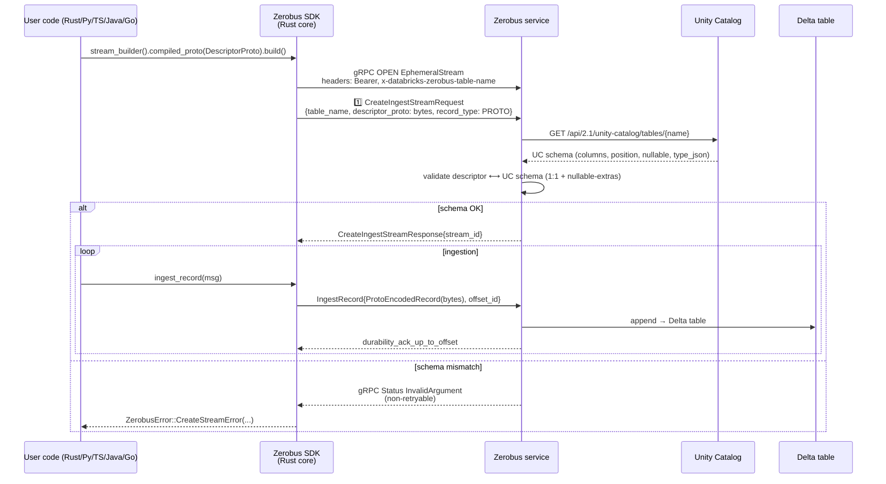
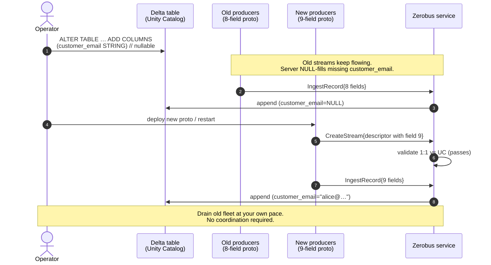
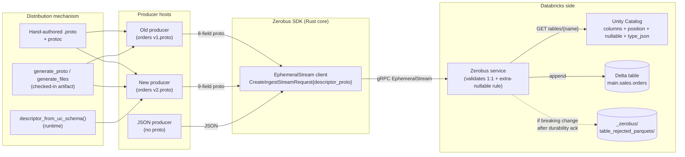

# 02 — Delta Lake schema evolution & protobuf distribution in Zerobus

> **Research target:** how Delta-table schema evolution (specifically: adding a column) is
> handled by the Zerobus Ingest service, and how the resulting protobuf file is distributed
> across Zerobus SDK clients (Rust / Python / TypeScript / Java / Go).
>
> **Repo under study:** [`mdrakiburrahman/zerobus-sdk`](https://github.com/mdrakiburrahman/zerobus-sdk)
> at commit `273efe09130a7554e6b34d20b95df50289e58524`. This tree is **byte-identical** to
> [`databricks/zerobus-sdk@main`](https://github.com/databricks/zerobus-sdk) at the same
> SHA — every root-tree blob SHA matches, so all citations apply equally to the upstream
> repo[^upstream].
>
> **Authoritative public docs:** the Microsoft Learn pages under
> `learn.microsoft.com/en-us/azure/databricks/ingestion/zerobus-*`[^docs-overview][^docs-limits][^docs-ingest][^docs-errors].

## AI summary

 1. Zerobus never auto-evolves the table — UC is the source of truth. Schema match is strict 1:1 with one carve-out: extra nullable columns the proto doesn't declare are server-side NULL-filled. That carve-out is the 
entire officially supported evolution path.
 2. Wire mechanism: a single serialized DescriptorProto in CreateIngestStreamRequest.descriptor_proto (field 3 of EphemeralStream's opening frame). Sent once, replayed on every reconnect. No schema registry, no version, 
no fingerprint.
 3. The crucial SDK invariant: proto field number = UC position + 1, deliberately preserving gaps from DROP COLUMN under Delta column-mapping — unit-tested at rust/sdk/src/schema.rs:724-737.
 4. Three distribution patterns: hand-authored .proto + protoc; CLI generate_proto/generate_files against UC; or descriptor_from_uc_schema() at runtime (Rust v1.2.0+, no .proto artifact required). JSON mode skips proto 
distribution entirely.
 5. Adding a column workflow: ALTER TABLE … ADD COLUMNS nullable → old producers keep flowing (NULL fill) → regenerate proto (new field gets a fresh number = old_max+1) → roll out new producers at your own pace. No 
coordinated stop-the-world.
 6. Latent inconsistency worth flagging: the Python generator uses sequential numbering, not position + 1, so it does not survive DROP COLUMN under column-mapping. The Rust generator does. Likely a bug.

---

## Executive summary

1. **Zerobus never auto-evolves the Delta table** — the Unity Catalog table is the
   authoritative schema and the service refuses to mutate it. *“Zerobus Ingest will
   **never** auto-evolve your target table.”*[^docs-limits-evolution]
2. **The wire schema is a serialized `DescriptorProto` (a single message descriptor) sent
   once, as the first frame of the bidirectional `EphemeralStream` gRPC**, inside
   `CreateIngestStreamRequest.descriptor_proto`[^proto-create-stream][^lib-create-stream].
3. **Schema validation is strict 1:1 with one curated exception:** *“The protobuf schema
   definition must match 1:1 with the Delta table schema (excluding extra nullable delta
   columns, which are considered a non-breaking schema change). If the schema does not
   match, the API returns an error.”*[^docs-limits-protobuf] Extra nullable columns in the
   table that the proto does **not** declare are silently filled with `NULL`.
4. **Adding a nullable column is the only officially supported evolution:** *“Zerobus
   Ingest supports continuous ingestion when nullable Delta columns are added to the
   target table. Missing columns are filled with `NULL` values, allowing you to send
   records with missing fields.”*[^docs-limits-evolution] Existing producers keep working
   while new producers are rolled out at their own pace.
5. **There is no schema registry, no schema version, and no schema fingerprint.** The
   server returns offset-based ACKs only[^arrow-metadata]; clients are responsible for
   keeping their compiled `.proto` and the UC schema aligned out-of-band.
6. **The SDK anchors protobuf field numbers to Unity Catalog column `position`:**
   `proto field number = position + 1`, deliberately preserving gaps left by `DROP COLUMN`
   in Delta column-mapping mode. This is the key correctness invariant for evolution and
   is enforced (and unit-tested) in the Rust core[^schema-position-comment][^schema-position-test].
7. **Three distribution patterns are supported by the SDKs**, in increasing order of
   operational simplicity: hand-authored `.proto` files compiled with `protoc`,
   tool-generated `.proto` files (`generate_proto` / `generate_files`) checked in or
   shipped as language artifacts, and fully runtime-built descriptors via
   `schema::descriptor_from_uc_schema(...)` that pull the live UC schema at process
   startup[^schema-mod-doc][^changelog-rust-1-2-0].
8. **JSON mode is the schema-distribution-free escape hatch.** No descriptor is sent;
   the server validates incoming JSON field names against UC server-side. Adding a
   nullable column becomes a zero-deploy operation on the producer
   side[^root-readme-formats].
9. **Breaking changes (drop / rename / non-nullable add / narrow) are non-retryable.**
   `INVALID_ARGUMENT` is in `UNRETRIABLE_STATUS_CODES`[^errors-retry]; in-flight records
   that have been durabilized but not yet published land in
   `_zerobus/table_rejected_parquets/`[^docs-overview-fallback].

---

## 1. The handshake: where the schema lives on the wire

The Zerobus client and service exchange one bidirectional gRPC stream per producer
session, defined as `EphemeralStream` in `rust/sdk/zerobus_service.proto`[^proto-create-stream].
The first message the client sends is **always** a `CreateIngestStreamRequest`:

```protobuf
message CreateIngestStreamRequest {
  optional string table_name = 1;        // three-part UC name: catalog.schema.table
  reserved "stream_id"; reserved 2;      // persisted streams not supported
  optional bytes  descriptor_proto = 3;  // serialized prost_types::DescriptorProto
  optional RecordType record_type = 4;   // PROTO=1, JSON=2 (default PROTO)
}
```
[^proto-create-stream]

The server validates the descriptor against Unity Catalog and replies with a UUID
`stream_id`; only after that does the SDK start streaming records[^lib-create-stream].



The descriptor in field `3` is the result of `prost::Message::encode_to_vec()` on a
`prost_types::DescriptorProto` — i.e. **a single message descriptor**, not a full
`FileDescriptorProto` or `FileDescriptorSet`[^lib-create-stream]. Records that follow are
just the raw prost-encoded bytes of that message, wrapped in either
`IngestRecordRequest.ProtoEncodedRecord` (singletons) or
`IngestRecordBatchRequest.ProtoEncodedBatch` (batches)[^record-types].

A few invariants flow from this design:

- **The descriptor is sent exactly once per stream**, on `CreateStream`.
- **Recovery re-sends the same descriptor.** On every reconnect attempt, the supervisor
  task in `lib.rs` clones `table_properties` (which carries `descriptor_proto`) and
  performs a fresh handshake — the server caches no schema across reconnects[^lib-recovery].
- **You cannot switch schema mid-stream.** *“The connector does not support using a
  different proto schema for ‘stream creation’ and ‘ingest record’ operations.”*[^docs-limits-protobuf]
- **There is no `mergeSchema` / `schemaLocation` analogue** in the wire protocol — the
  proto only carries `table_name`, `descriptor_proto`, `record_type`[^proto-create-stream].

---

## 2. How Zerobus matches your proto to the Delta table

This section is the heart of the schema-evolution story. There are three identifiers
in play; understanding them is what makes a column add safe.

### 2a. Identifiers, side-by-side

| Layer | Stable ID | Display name |
|---|---|---|
| Delta protocol (column-mapping mode) | `delta.columnMapping.id` (32-bit) and `delta.columnMapping.physicalName` | the SQL `name` field — changeable by `ALTER … RENAME`[^delta-protocol-cm-modes] |
| Unity Catalog REST API (`GET /api/2.1/unity-catalog/tables/{name}`) | `position` (0-indexed) | `name` |
| Protobuf wire | `field number` (1-based, immutable once in use)[^proto-field-numbers] | `field name` |

The SDK bridges these worlds with a single, deliberate rule[^schema-position-comment]:

```rust
// rust/sdk/src/schema.rs
// Protobuf field number = UC position + 1. Unity Catalog's `position` is
// 0-indexed; adding 1 produces a valid proto field number and preserves
// any gaps UC reports (e.g. after DROP COLUMN in column-mapping mode),
// keeping a one-to-one correspondence between field number and UC column.
for column in sorted.iter() {
    // …
    fields.push(field_descriptor(
        &column.name,
        column.position + 1,   //  ← THE rule
        field_type, type_name, column.nullable, is_repeated,
    ));
}
```

This is unit-tested explicitly[^schema-position-test]:

```rust
#[test]
fn field_numbers_mirror_uc_position() {
    let cols = vec![
        col("a", "STRING", true, 0),
        col("b", "STRING", true, 4),  // position 4 (gap intentional — DROP COLUMN)
        col("c", "STRING", true, 8),  // position 8 (gap intentional — DROP COLUMN)
    ];
    let d = descriptor_from_uc_columns(&cols, "m").unwrap();
    assert_eq!(field(&d, "a").number(), 1);
    assert_eq!(field(&d, "b").number(), 5);
    assert_eq!(field(&d, "c").number(), 9);
}
```

`nullable=true` becomes `Label::Optional`, `nullable=false` becomes `Label::Required`,
and arrays/maps always become `Label::Repeated`[^schema-nullable-label].

### 2b. What the server actually enforces

From the official limits page, verbatim[^docs-limits-protobuf]:

> The protobuf schema definition must match 1:1 with the Delta table schema (excluding
> extra nullable delta columns, which are considered a non-breaking schema change). If
> the schema does not match, the API returns an error. This includes:
> - Different number of columns
> - Different column names
> - Different column optionality (nullable and non-nullable)
> - The connector does not support proto schemas with more than 2000 columns.
> - The connector only supports table and column names with ASCII letters, digits, and
>   underscores.
> - The connector does not support using a different proto schema for 'stream creation'
>   and 'ingest record' operations.

The single curated exception is the `nullable` column carve-out[^docs-limits-evolution]:

> Zerobus Ingest supports continuous ingestion when nullable Delta columns are added to
> the target table. Missing columns are filled with `NULL` values, allowing you to send
> records with missing fields.

> ⚠️ **Documentation gap.** Databricks does not say *which* identifier the server uses
> to pair proto fields with table columns — name, number, or both. The SDK side anchors
> field numbers to UC `position`, which is structurally aligned with the *order* the
> server sees columns in. Combined with the “different column names” error, the
> behaviour you can rely on is: **both name and number must align across the proto and
> the table**, so don’t reuse field numbers and don’t rename columns without
> coordinating both sides.

### 2c. Why protobuf already makes “add a column” safe

Protobuf wire format is fundamentally tag-based, and the language guide states the
guarantee in plain text[^protobuf-wire-safe]:

> Adding new fields is safe. If you add new fields, any messages serialized by code
> using your 'old' message format can still be parsed by your new generated code.
> Similarly, messages created by your new code can be parsed by your old code: old
> binaries simply ignore the new field when parsing.

That property is what lets old producers keep writing the old proto while new producers
write the new proto, both into the same Delta table — provided the new field number is
fresh (which `position + 1` guarantees), and the table already has the column declared
nullable.

---

## 3. Authoring & distributing the proto: five SDKs, three patterns

Every SDK ultimately hands the Rust core a `DescriptorProto` (single message), but the
ergonomics of *getting there* differ. The repository provides three distribution
patterns; teams can mix them.

### 3a. Pattern A — Hand-authored `.proto` + `protoc`

Recommended starting point. The user writes a `.proto` file with `proto2` syntax and
`optional` fields[^root-readme-proto2], compiles it with `protoc` (or each SDK’s
preferred tool), and ships the generated language bindings with the producer
application[^per-sdk-proto-handoff].

Canonical example (identical across Python, TypeScript, Go, Java with package
options)[^canonical-proto]:

```protobuf
syntax = "proto2";
package examples;

message AirQuality {
    optional string device_name = 1;
    optional int32  temp        = 2;
    optional int64  humidity    = 3;
}
```

### 3b. Pattern B — Tool-generated `.proto` from Unity Catalog (offline)

Each SDK ships a CLI generator that calls the UC REST API and emits a `.proto` (and,
for Rust, also a `.descriptor` binary and a generated `.rs`)[^uc-fetch-rust][^uc-fetch-python].

```
                       GET /api/2.1/unity-catalog/tables/{full_name}
generate_proto / generate_files  ───────────────────────────────────────►  Unity Catalog
        │  ◄────────────────  columns: [{name, type_name, type_text, type_json,
        │                              nullable, position}, …]
        │
        ├──►  <table>.proto         (proto2 source)
        ├──►  <table>.descriptor    (binary FileDescriptorSet, Rust only)
        └──►  <table>.<lang>        (compiled bindings, Rust-only via tonic-build)
```

The Rust generator is gap-preserving: field numbers come straight from UC `position +
1` via `descriptor_from_uc_columns`[^uc-fetch-rust]. The Python generator is **not**
gap-preserving — it uses a sequential 1, 2, 3, … counter[^uc-fetch-python]. For a freshly
created table that has never had a `DROP COLUMN`, both produce the same field numbers;
for a table with column-mapping holes, only the Rust generator stays compatible across
schema edits.

### 3c. Pattern C — Runtime descriptor construction (Rust v1.2.0+)

The newest and most operationally clean option, added in Rust SDK
v1.2.0[^changelog-rust-1-2-0]:

```rust
//! rust/sdk/src/schema.rs (module-level docstring, abridged)
//! Convert a Unity Catalog table schema into a protobuf [`DescriptorProto`].
//!
//! Callers that already have the Unity Catalog metadata for a table can use
//! [`descriptor_from_uc_columns`] or [`descriptor_from_uc_schema`] to build that
//! descriptor on the fly instead of pre-generating a `.proto` file offline.
```
[^schema-mod-doc]

This means a producer can simply restart and pick up the new column — no
`protoc`, no rebuild, no checked-in `.proto`. The same module enforces the
`position + 1` rule and the proto2 nullable-mapping invariants for you.

### 3d. The five SDK descriptor handoffs

| SDK | Where the descriptor comes from | API call |
|---|---|---|
| **Rust** | `prost_types::DescriptorProto` decoded from a `.descriptor` `FileDescriptorSet`, **or** built at runtime via `descriptor_from_uc_schema()` | `sdk.stream_builder().table(t).compiled_proto(descriptor).build()`[^rust-handoff] |
| **Python** | `record_pb2.AirQuality.DESCRIPTOR` (Python `Descriptor` object) — the PyO3 layer auto-extracts `message_type[0]` from the embedded `FileDescriptorProto` bytes | `TableProperties(table_name, descriptor)`[^python-handoff] |
| **TypeScript** | Binary `.pb` file produced by `protoc --descriptor_set_out=...`, extracted to a base64 `DescriptorProto` via `loadDescriptorProto({...})` helper | `{ tableName, descriptorProto: base64 }`[^ts-handoff] |
| **Java** | Compile-time-embedded; `AirQuality.getDescriptor().toProto().toByteArray()` via Java protobuf reflection | `sdk.createProtoStream(name, descriptorProto, id, secret)`[^java-handoff] |
| **Go** | `pb.File_air_quality_proto` → `protodesc.ToFileDescriptorProto(...)` → `MessageType[0]` → `proto.Marshal(...)` | `sdk.CreateStream(zerobus.TableProperties{ DescriptorProto: bytes }, …)`[^go-handoff] |

All five paths converge on **the same wire artifact**: the bytes of a single
`DescriptorProto` placed in `CreateIngestStreamRequest.descriptor_proto`.

### 3e. JSON mode — the no-distribution escape hatch

When `record_type = JSON`, no descriptor is sent at all. The Rust core is explicit about
this: `descriptor_proto = None`[^lib-create-stream]. The server matches incoming JSON
keys to UC column names server-side. This makes adding a nullable column a **zero-deploy
operation on producers**: add the column, then optionally start including the new key
in your JSON objects.

> *“**JSON** — Simple, schema-free ingestion. Pass a JSON string or native object (dict,
> map, etc.) and the SDK serializes it. No compilation step required. Good for getting
> started or dynamic schemas.”*[^root-readme-formats]

---

## 4. Walkthrough: adding a column to an existing Zerobus table

This is the canonical scenario the user asked about. It uses the `orders` table from
`rust/examples/proto/single/`. The current shape (8 columns) and proto[^orders-proto]:

```protobuf
syntax = "proto2";
package orders;

message table_Orders {
    optional int32  id            = 1;   // UC position 0
    optional string customer_name = 2;   // UC position 1
    optional string product_name  = 3;   // UC position 2
    optional int32  quantity      = 4;   // UC position 3
    optional double price         = 5;   // UC position 4
    optional string status        = 6;   // UC position 5
    optional int64  created_at    = 7;   // UC position 6
    optional int64  updated_at    = 8;   // UC position 7
}
```

We want to add a nullable `customer_email` column.

### Step 1 — Evolve the Delta table first

```sql
ALTER TABLE main.sales.orders
  ADD COLUMNS (customer_email STRING);  -- nullable=true by default in Databricks
```

By default, Delta marks new columns as nullable[^delta-update-schema], and existing
rows receive `NULL`[^delta-update-schema-insert] for the new column. UC assigns the new
column `position = 8`. The Delta column-mapping layer also assigns it a fresh
`delta.columnMapping.id` and `physicalName`[^delta-protocol-physname], so existing
Parquet files (which lack the column) are still legal and are read back as `NULL`.

> ⚠️ **You cannot ADD COLUMN as `NOT NULL` and have old producers keep working.** The
> Zerobus server will start refusing the old proto on “different column optionality”
> the moment a new stream attempts to open against the new table[^docs-limits-protobuf].

### Step 2 — Old producers keep running

Because (a) protobuf parsing ignores unknown fields and (b) Zerobus explicitly allows
extra nullable Delta columns, the existing producer fleet is still valid. Each record
they send is missing one column on the wire; the server fills `NULL`[^docs-limits-evolution].
No restart, no redeploy.

### Step 3 — Regenerate the proto

Pick a distribution pattern:

```bash
# Pattern B — Rust offline generator (recommended; gap-preserving)
cd rust/tools/generate_files
cargo run -- \
  --uc-endpoint https://<workspace>.cloud.databricks.com \
  --client-id   $DATABRICKS_CLIENT_ID \
  --client-secret $DATABRICKS_CLIENT_SECRET \
  --table        main.sales.orders \
  --output-dir   ../../examples/proto/single/output
```

The new `orders.proto` will be:

```diff
 message table_Orders {
     optional int32  id             = 1;
     optional string customer_name  = 2;
     optional string product_name   = 3;
     optional int32  quantity       = 4;
     optional double price          = 5;
     optional string status         = 6;
     optional int64  created_at     = 7;
     optional int64  updated_at     = 8;
+    optional string customer_email = 9;   // UC position 8 → field number 9
 }
```

Note the field number `9`. Because `field number = position + 1`, the new column
gets a fresh, never-before-used tag — exactly what protobuf compatibility
rules require for safe addition[^protobuf-wire-safe].

For Pattern C (runtime), there is **no diff** — your Rust producer code is unchanged.
At process restart, `descriptor_from_uc_schema()` re-fetches the UC schema and emits a
`DescriptorProto` that already includes field 9.

### Step 4 — Roll out new producers



Because the two protos differ only by the appended field, both serialize records that
the server can write into the same Delta table. Protobuf’s “new code parses old data,
old code parses new data” property is intact[^protobuf-wire-safe].

### Step 5 — (Optional) Drop the old proto from your build

Once telemetry confirms no producers are still running the old binary, you can delete
the v1 `.proto` artifact from your build pipelines. The Delta column itself is permanent
(adding a column is a one-way operation under Delta unless you also `overwriteSchema`).

---

## 5. The breaking-change cliff

Everything outside the “add a nullable column” lane is breaking from the Zerobus
service’s perspective and stops every active stream.

| Change | Behavior | Inferred mitigation |
|---|---|---|
| `ALTER … ADD COLUMNS` **NOT NULL** | Server rejects old proto on next `CreateStream` (different optionality)[^docs-limits-protobuf] | Add as nullable, then enforce non-null at app layer |
| `ALTER … DROP COLUMN` | Old proto fails (different number of columns); under column-mapping the column is logically gone but its `position` gap is preserved by `position + 1` rule[^schema-position-comment] | Stop producers, regenerate proto, redeploy |
| `ALTER … RENAME COLUMN` | Old proto fails (different column names)[^docs-limits-protobuf] | Add new column → backfill → drop old column over multiple deploys |
| Type narrow (e.g. `LONG → INT`) | Not addressed in docs; would surface as a schema mismatch | Use Delta type-widening only[^delta-type-widening], never narrowing |
| Type widening (Delta-supported widenings) | Not explicitly documented for Zerobus[^delta-type-widening] | Treat as breaking until Databricks documents otherwise |

The wire-protocol behavior on a server-side rejection: gRPC `Status::InvalidArgument`,
mapped to `ZerobusError::CreateStreamError(...)` and **classified non-retryable** by the
SDK[^errors-retry]:

```rust
const UNRETRIABLE_STATUS_CODES: [tonic::Code; 6] = [
    tonic::Code::InvalidArgument,
    tonic::Code::Unauthenticated,
    tonic::Code::PermissionDenied,
    tonic::Code::OutOfRange,
    tonic::Code::Unimplemented,
    tonic::Code::NotFound,
];
```

This is the supervisor’s signal to stop reconnecting and surface the error to the user
code — **the SDK will not auto-recover from a schema break.**

For records already inside Zerobus’s durability layer when the table goes incompatible,
Databricks has a documented rescue path[^docs-overview-fallback]:

> If a breaking change is made to your target table after Zerobus Ingest makes your
> data durable before Zerobus Ingest has a chance to publish (push file to storage),
> the connector will make the data available in a separate folder within your table's
> storage location.
>
> Data is persisted as Parquet files under the following path relative to the table
> root directory: `_zerobus/table_rejected_parquets/`.

The docs do not provide a runbook for replaying these files; that is left to the
operator.

---

## 6. Putting it all together: architecture



---

## 7. Practical recommendations

### For producers
- **Default to JSON for fluid schemas.** It is the lowest-friction path through
  evolution and aligns with the Databricks-recommended workflow for adding nullable
  columns.
- **For typed Rust producers, prefer Pattern C** (`descriptor_from_uc_schema()`) so a
  schema change is a process restart away. Pre-generated `.proto` files are still useful
  when you want compile-time type checking inside the producer.
- **Always use `proto2` with `optional`.** The `optional` label is the only way to
  express “absent ⇒ NULL”, which is what nullable Delta columns require[^root-readme-proto2].
- **Never reuse a field number.** The SDK already guarantees this if you regenerate via
  the Rust tooling (which uses `position + 1` and skips reserved 19000–19999); if you
  hand-edit `.proto` files, treat dropped UC columns as `reserved` field numbers.

### For schema owners
- **Add columns nullable, append at the end.** That is the only path that lets old
  producers keep writing without redeploying.
- **Prefer Delta column-mapping mode** if you anticipate `RENAME` or `DROP` operations.
  Without column mapping, those operations require rewriting the table[^delta-update-schema-rewrite].
- **Document field-number reservations** alongside your `.proto` file; the SDK preserves
  position gaps on `DROP COLUMN`, so consumers should treat dropped tags as permanently
  unavailable.

### For platform/SDK owners
- **Mind the Python generator’s sequential numbering.** Unlike the Rust generator, it
  does not preserve UC `position` gaps[^uc-fetch-python]. For tables that have ever had
  a `DROP COLUMN` under column-mapping, the Python generator will produce a `.proto` that
  no longer round-trips with UC. Track the bug or align it with the Rust generator’s
  `descriptor_from_uc_columns` semantics.
- **Consider exposing an SDK-level “rotate descriptor” call.** The current
  `descriptor_proto` is captured at builder time and replayed verbatim on every recovery
  reconnect[^lib-recovery]. Mid-stream schema rotation is explicitly not supported, but
  a “restart-with-fresh-descriptor” helper would make Pattern C even more ergonomic.

---

## 8. Confidence assessment

| Claim | Confidence | Why |
|---|---|---|
| Wire format & handshake (proto descriptor in `CreateIngestStreamRequest`) | **High** | Verbatim quotes from `zerobus_service.proto` and `lib.rs`; cross-checked against Microsoft Learn docs[^proto-create-stream][^lib-create-stream][^docs-ingest]. |
| Strict 1:1 + extra-nullable carve-out | **High** | Verbatim from `learn.microsoft.com/.../zerobus-limits`[^docs-limits-protobuf]. |
| `field number = UC position + 1` and gap-preservation | **High** | Code comment + dedicated unit test in the Rust core[^schema-position-comment][^schema-position-test]. |
| `nullable=false → Required`, `nullable=true → Optional` | **High** | Direct code citation[^schema-nullable-label]. |
| Proto add-column compatibility | **High** | protobuf.dev language guide guarantees this[^protobuf-wire-safe]. |
| `descriptor_from_uc_schema()` runtime path | **High** | Module-level doc + v1.2.0 changelog[^schema-mod-doc][^changelog-rust-1-2-0]. |
| Recovery re-sends the same descriptor | **High** | Supervisor task code path in `lib.rs`[^lib-recovery]. |
| “Server resolves columns by name *and* number both” | **Inferred** | Docs reject mismatches on both name and optionality; SDK numbers anchor to position. The exact server algorithm is not spelled out[^docs-limits-protobuf]. |
| `_zerobus/table_rejected_parquets/` rescue procedure | **Medium** | Existence is documented; no recovery runbook is published[^docs-overview-fallback]. |
| Type-widening behavior under Zerobus | **Low** | Not addressed by Databricks docs at all[^delta-type-widening]. |
| Python generator gap-preservation gap is intentional | **Inferred** | No issue/PR found; the divergence from the Rust generator looks like a latent bug rather than a deliberate design choice[^uc-fetch-python]. |

---

## Appendix A — Key repositories & files

| Repo | Path | Role |
|---|---|---|
| [`mdrakiburrahman/zerobus-sdk`](https://github.com/mdrakiburrahman/zerobus-sdk) ≡ [`databricks/zerobus-sdk`](https://github.com/databricks/zerobus-sdk) | `rust/sdk/zerobus_service.proto` | Wire definition; `CreateIngestStreamRequest.descriptor_proto` field 3 |
| same | `rust/sdk/src/lib.rs` | `create_stream_connection` (handshake) and the recovery supervisor loop |
| same | `rust/sdk/src/schema.rs` | UC → `DescriptorProto` conversion; `position + 1` rule; type mapping |
| same | `rust/sdk/src/record_types.rs` | Per-record encoding to `EphemeralStreamRequest` payload |
| same | `rust/sdk/src/errors.rs` | `ZerobusError` taxonomy and `UNRETRIABLE_STATUS_CODES` |
| same | `rust/tools/generate_files/src/{main,generate}.rs` | Offline `.proto` + `.descriptor` + `.rs` generator (gap-preserving) |
| same | `python/zerobus/tools/generate_proto.py` | Python `.proto` generator (sequential numbering) |
| same | `rust/CHANGELOG.md` | v1.1.0 (skip 19000–19999), v1.2.0 (`schema` module + breaking field-number rule) |
| same | `README.md`, `python/README.md`, `rust/README.md`, `typescript/README.md`, `java/README.md`, `go/README.md` | Per-SDK proto authoring + descriptor handoff guidance |
| Docs | [`learn.microsoft.com/.../ingestion/zerobus-overview`](https://learn.microsoft.com/en-us/azure/databricks/ingestion/zerobus-overview) | Concepts, durability, fallback location |
| Docs | [`learn.microsoft.com/.../ingestion/zerobus-limits`](https://learn.microsoft.com/en-us/azure/databricks/ingestion/zerobus-limits) | The authoritative schema-evolution rules |
| Docs | [`learn.microsoft.com/.../ingestion/zerobus-ingest`](https://learn.microsoft.com/en-us/azure/databricks/ingestion/zerobus-ingest) | Per-language ingest API surface |
| Docs | [`learn.microsoft.com/.../ingestion/zerobus-errors`](https://learn.microsoft.com/en-us/azure/databricks/ingestion/zerobus-errors) | `INVALID_ARGUMENT` semantics |
| Docs | [`delta-io/delta:PROTOCOL.md`](https://github.com/delta-io/delta/blob/master/PROTOCOL.md) | Column-mapping spec (`name`, `id`, `physicalName`) |
| Docs | [`protobuf.dev/programming-guides/proto3`](https://protobuf.dev/programming-guides/proto3/) | Field-number immutability and wire-safe changes |

---

## Footnotes

[^upstream]: Both `mdrakiburrahman/zerobus-sdk@main` and `databricks/zerobus-sdk@main` resolve to commit `273efe09130a7554e6b34d20b95df50289e58524`; every root-tree blob SHA matches between the two repos. The fork is perfectly synchronized and contains no drift in `rust/sdk/src/schema.rs`, `rust/sdk/zerobus_service.proto`, `CHANGELOG.md`, or `NEXT_CHANGELOG.md`.

[^docs-overview]: <https://learn.microsoft.com/en-us/azure/databricks/ingestion/zerobus-overview>

[^docs-limits]: <https://learn.microsoft.com/en-us/azure/databricks/ingestion/zerobus-limits>

[^docs-ingest]: <https://learn.microsoft.com/en-us/azure/databricks/ingestion/zerobus-ingest>

[^docs-errors]: <https://learn.microsoft.com/en-us/azure/databricks/ingestion/zerobus-errors>

[^docs-limits-evolution]: “Zerobus Ingest will **never** auto-evolve your target table.” … “Zerobus Ingest supports continuous ingestion when nullable Delta columns are added to the target table. Missing columns are filled with `NULL` values, allowing you to send records with missing fields.” — `Schema evolution` section of <https://learn.microsoft.com/en-us/azure/databricks/ingestion/zerobus-limits>.

[^docs-limits-protobuf]: “The protobuf schema definition must match 1:1 with the Delta table schema (excluding extra nullable delta columns, which are considered a non-breaking schema change). … This includes: Different number of columns; Different column names; Different column optionality (nullable and non-nullable); … The connector does not support using a different proto schema for 'stream creation' and 'ingest record' operations.” — `Protobuf schema` section of <https://learn.microsoft.com/en-us/azure/databricks/ingestion/zerobus-limits>.

[^docs-overview-fallback]: “If a breaking change is made to your target table after Zerobus Ingest makes your data durable before Zerobus Ingest has a chance to publish … Data is persisted as Parquet files under the following path relative to the table root directory: `_zerobus/table_rejected_parquets/`.” — `Durable Fallback Location` section of <https://learn.microsoft.com/en-us/azure/databricks/ingestion/zerobus-overview>.

[^proto-create-stream]: `rust/sdk/zerobus_service.proto` defines `rpc EphemeralStream(stream EphemeralStreamRequest) returns (stream EphemeralStreamResponse);` and `message CreateIngestStreamRequest { optional string table_name = 1; reserved "stream_id"; reserved 2; optional bytes descriptor_proto = 3; optional RecordType record_type = 4; }`. Comment on field 3: “Protocol buffer descriptor for record serialization/deserialization. … This is a required field for all stream creation requests.” See [`rust/sdk/zerobus_service.proto`](https://github.com/mdrakiburrahman/zerobus-sdk/blob/273efe09130a7554e6b34d20b95df50289e58524/rust/sdk/zerobus_service.proto#L89-L95).

[^lib-create-stream]: The `create_stream_connection` function in `rust/sdk/src/lib.rs:1217-1329` opens the gRPC bidir stream, sets `authorization` and `x-databricks-zerobus-table-name` headers, and immediately sends a `RequestPayload::CreateStream(CreateIngestStreamRequest { table_name, descriptor_proto: Some(table_properties.descriptor_proto.encode_to_vec()), record_type })`, then awaits the `CreateIngestStreamResponse` to obtain a UUID `stream_id`. For `record_type = JSON` the `descriptor_proto` is `None`. See [`rust/sdk/src/lib.rs`](https://github.com/mdrakiburrahman/zerobus-sdk/blob/273efe09130a7554e6b34d20b95df50289e58524/rust/sdk/src/lib.rs#L1217-L1329).

[^lib-recovery]: The supervisor task in `rust/sdk/src/lib.rs:1039-1211` re-runs `create_stream_connection` on every reconnect attempt and clones the full `TableProperties` (which carries `descriptor_proto`) into the `create_attempt` closure at lines 1075-1087. After each successful reconnect, `landing_zone.reset_observe()` moves all observed-but-unACKed records back to the unobserved queue for replay. See [`rust/sdk/src/lib.rs`](https://github.com/mdrakiburrahman/zerobus-sdk/blob/273efe09130a7554e6b34d20b95df50289e58524/rust/sdk/src/lib.rs#L1039-L1211).

[^record-types]: `rust/sdk/src/record_types.rs:213-249`, `EncodedBatch::into_request_payload`: single proto records become `IngestRecordRequest{record: Some(IngestRequestRecord::ProtoEncodedRecord(bytes))}`; batches become `IngestRecordBatchRequest{batch: Some(IngestRequestBatch::ProtoEncodedBatch(ProtoEncodedRecordBatch{records}))}`. Each proto record is the prost-encoded bytes of the user’s message — no extra framing beyond gRPC HTTP/2. See [`rust/sdk/src/record_types.rs`](https://github.com/mdrakiburrahman/zerobus-sdk/blob/273efe09130a7554e6b34d20b95df50289e58524/rust/sdk/src/record_types.rs#L213-L249).

[^errors-retry]: `rust/sdk/src/errors.rs`: `is_retryable()` returns false for any `tonic::Code` in `UNRETRIABLE_STATUS_CODES = [InvalidArgument, Unauthenticated, PermissionDenied, OutOfRange, Unimplemented, NotFound]`. A schema rejection therefore short-circuits the supervisor’s retry loop. See [`rust/sdk/src/errors.rs`](https://github.com/mdrakiburrahman/zerobus-sdk/blob/273efe09130a7554e6b34d20b95df50289e58524/rust/sdk/src/errors.rs#L1-L80).

[^arrow-metadata]: `rust/sdk/src/arrow_metadata.rs` defines `FlightAckMetadata { ack_up_to_offset: i64, ack_up_to_records: u64 }` with the special sentinel `STREAM_READY_OFFSET = -1` to mark “stream setup succeeded (schema validation, table access).” There is no version, fingerprint, or schema-id field on either the proto or Arrow Flight ACK paths. See [`rust/sdk/src/arrow_metadata.rs`](https://github.com/mdrakiburrahman/zerobus-sdk/blob/273efe09130a7554e6b34d20b95df50289e58524/rust/sdk/src/arrow_metadata.rs).

[^schema-mod-doc]: Module-level docstring of `rust/sdk/src/schema.rs:1-80`: “Convert a Unity Catalog table schema into a protobuf [`DescriptorProto`]. The Zerobus service accepts records described by a protobuf message descriptor. Callers that already have the Unity Catalog metadata for a table can use [`descriptor_from_uc_columns`] or [`descriptor_from_uc_schema`] to build that descriptor on the fly instead of pre-generating a `.proto` file offline.” The doc also fixes the encoding contract for `DATE` (days since epoch) and `TIMESTAMP*` (microseconds since epoch). See [`rust/sdk/src/schema.rs`](https://github.com/mdrakiburrahman/zerobus-sdk/blob/273efe09130a7554e6b34d20b95df50289e58524/rust/sdk/src/schema.rs#L1-L80).

[^schema-position-comment]: `rust/sdk/src/schema.rs:159-162`: “Protobuf field number = UC position + 1. Unity Catalog's `position` is 0-indexed; adding 1 produces a valid proto field number and preserves any gaps UC reports (e.g. after DROP COLUMN in column-mapping mode), keeping a one-to-one correspondence between field number and UC column.” The corresponding line in `descriptor_from_uc_columns` is `column.position + 1` at line 186. See [`rust/sdk/src/schema.rs`](https://github.com/mdrakiburrahman/zerobus-sdk/blob/273efe09130a7554e6b34d20b95df50289e58524/rust/sdk/src/schema.rs#L159-L186).

[^schema-position-test]: Unit test `field_numbers_mirror_uc_position` at `rust/sdk/src/schema.rs:724-737` constructs UC columns at positions 0, 4, 8 (the 4-and-8 simulate dropped intermediate columns) and asserts the resulting proto field numbers are 1, 5, 9. See [`rust/sdk/src/schema.rs`](https://github.com/mdrakiburrahman/zerobus-sdk/blob/273efe09130a7554e6b34d20b95df50289e58524/rust/sdk/src/schema.rs#L724-L737).

[^schema-nullable-label]: `rust/sdk/src/schema.rs:215-240`, `field_descriptor`: `let label = if is_repeated { Label::Repeated } else if nullable { Label::Optional } else { Label::Required };`. See [`rust/sdk/src/schema.rs`](https://github.com/mdrakiburrahman/zerobus-sdk/blob/273efe09130a7554e6b34d20b95df50289e58524/rust/sdk/src/schema.rs#L215-L240).

[^uc-fetch-rust]: `rust/tools/generate_files/src/generate.rs:39-75` defines `fetch_table_info` which calls `GET {endpoint}/api/2.1/unity-catalog/tables/{url_encoded_table}` with a Bearer token and deserializes the response into `TableInfo { columns: Vec<UcColumn> }` — pulling `name`, `type_name`, `type_text`, `type_json`, `nullable`, `position`. The output stage at `generate.rs:222-240` writes `<name>.proto`, `<name>.descriptor` (binary `FileDescriptorSet`), and `<name>.rs` (prost-generated). See [`rust/tools/generate_files/src/generate.rs`](https://github.com/mdrakiburrahman/zerobus-sdk/blob/273efe09130a7554e6b34d20b95df50289e58524/rust/tools/generate_files/src/generate.rs#L39-L240).

[^uc-fetch-python]: `python/zerobus/tools/generate_proto.py:135-178`. `fetch_table_info` hits the same `GET /api/2.1/unity-catalog/tables/{name}` endpoint, but `extract_columns` keeps only `{name, type_text, nullable}` — it drops `position`, `type_name`, and `type_json`. The proto-generation loop assigns field numbers from a sequential counter (skipping 19000–19999), not from `position`, so it does not preserve gaps left by DROP COLUMN under Delta column-mapping. The Python generator only writes a `.proto` file; bindings/descriptor compilation is left to the user’s `protoc`. See [`python/zerobus/tools/generate_proto.py`](https://github.com/mdrakiburrahman/zerobus-sdk/blob/273efe09130a7554e6b34d20b95df50289e58524/python/zerobus/tools/generate_proto.py#L135-L178).

[^changelog-rust-1-2-0]: `rust/CHANGELOG.md`, `## Release v1.2.0`: New Features include “Added the `schema` module with `descriptor_from_uc_columns` / `descriptor_from_uc_schema`, which convert a Unity Catalog table schema (including nested STRUCT, ARRAY, and MAP columns via `type_json`) into a `prost_types::DescriptorProto` that can be passed to `TableProperties::descriptor_proto`. Enables building descriptors at runtime without pre-generating `.proto` files.” Breaking Changes include “Field numbers now follow Unity Catalog's `position + 1` (so gaps from `DROP COLUMN` under Delta column-mapping are preserved) instead of the previous 1,2,3… sequential numbering with a 19000-range skip.” See [`rust/CHANGELOG.md`](https://github.com/mdrakiburrahman/zerobus-sdk/blob/273efe09130a7554e6b34d20b95df50289e58524/rust/CHANGELOG.md).

[^root-readme-formats]: Repository root `README.md`, `## Serialization Formats`: “**JSON** — Simple, schema-free ingestion. Pass a JSON string or native object (dict, map, etc.) and the SDK serializes it. No compilation step required. Good for getting started or dynamic schemas. **Protocol Buffers** — Strongly-typed, schema-validated ingestion. More efficient over the wire. Recommended for production workloads.” See [`README.md`](https://github.com/mdrakiburrahman/zerobus-sdk/blob/273efe09130a7554e6b34d20b95df50289e58524/README.md).

[^root-readme-proto2]: Repository root `README.md`, `### Protocol Buffers`: “Use `proto2` syntax with `optional` fields to correctly represent nullable Delta table columns.” See [`README.md`](https://github.com/mdrakiburrahman/zerobus-sdk/blob/273efe09130a7554e6b34d20b95df50289e58524/README.md).

[^per-sdk-proto-handoff]: Per-SDK `examples/proto/README.md` files demonstrate the same pattern: hand-author `.proto` (proto2 + optional), compile with the language’s preferred tool (`grpc_tools.protoc` for Python, `pbjs/pbts/protoc` for TypeScript, `protoc-gen-go` for Go, `protoc` + `protobuf-java` for Java, `tonic-build`/`prost-build` for Rust), then pass a `DescriptorProto` to the SDK at stream creation time.

[^canonical-proto]: `python/examples/record.proto` (and its byte-identical TypeScript/Go siblings): `syntax = "proto2"; package examples; message AirQuality { optional string device_name = 1; optional int32 temp = 2; optional int64 humidity = 3; }`. The Java variant adds `option java_package` and `option java_outer_classname`; the Go variant adds `option go_package`. See [`python/examples/record.proto`](https://github.com/mdrakiburrahman/zerobus-sdk/blob/273efe09130a7554e6b34d20b95df50289e58524/python/examples/record.proto).

[^rust-handoff]: `rust/examples/proto/single/src/main.rs:33-35` calls `load_descriptor_proto("output/orders.descriptor", "orders.proto", "table_Orders")` (defined at lines 167-183), then passes the resulting `prost_types::DescriptorProto` to `sdk_handle.stream_builder().table(TABLE_NAME).oauth(...).compiled_proto(descriptor_proto).build()`. See [`rust/examples/proto/single/src/main.rs`](https://github.com/mdrakiburrahman/zerobus-sdk/blob/273efe09130a7554e6b34d20b95df50289e58524/rust/examples/proto/single/src/main.rs#L33-L183).

[^python-handoff]: `python/zerobus/_zerobus_core.pyi:22-41` declares `class TableProperties: def __init__(self, table_name: str, descriptor_proto: Optional[Union[bytes, Any]] = None) -> None:` accepting raw `FileDescriptorProto` bytes, a Python `Descriptor` object (e.g. `MyMessage.DESCRIPTOR`), or `None` for JSON streams. The PyO3 binding extracts `message_type[0]` from the embedded `FileDescriptorProto` to get the `DescriptorProto` it forwards to Rust. See [`python/zerobus/_zerobus_core.pyi`](https://github.com/mdrakiburrahman/zerobus-sdk/blob/273efe09130a7554e6b34d20b95df50289e58524/python/zerobus/_zerobus_core.pyi#L22-L41).

[^ts-handoff]: `typescript/examples/proto/single.ts:45-63`: `const descriptorBase64 = loadDescriptorProto({ descriptorPath: 'schemas/air_quality_descriptor.pb', protoFileName: 'air_quality.proto', messageName: 'AirQuality' }); const tableProperties: TableProperties = { tableName: TABLE_NAME, descriptorProto: descriptorBase64 };`.

[^java-handoff]: `java/examples/proto/SingleRecordExample.java:38-43`: `ZerobusProtoStream stream = sdk.createProtoStream(tableName, AirQuality.getDescriptor().toProto(), clientId, clientSecret).join();`. The Java SDK uses Java protobuf reflection (`getDescriptorForType().toProto().toByteArray()`) to convert the compile-time-embedded descriptor.

[^go-handoff]: `go/examples/proto/single/main.go:22-55`: `fileDesc := pb.File_air_quality_proto; fileDescProto := protodesc.ToFileDescriptorProto(fileDesc); messageDescProto := fileDescProto.MessageType[0]; descriptorBytes, _ := proto.Marshal(messageDescProto); … sdk.CreateStream(zerobus.TableProperties{ TableName: tableName, DescriptorProto: descriptorBytes }, …)`.

[^orders-proto]: `rust/examples/proto/single/output/orders.proto` (canonical Rust example, generated by `generate_files`). All 8 columns are `optional`, matching their UC `nullable=true`; field numbers run 1..8 from `position 0..7 + 1`. See [`rust/examples/proto/single/output/orders.proto`](https://github.com/mdrakiburrahman/zerobus-sdk/blob/273efe09130a7554e6b34d20b95df50289e58524/rust/examples/proto/single/output/orders.proto).

[^delta-update-schema]: “`ALTER TABLE table_name ADD COLUMNS (col_name data_type [COMMENT col_comment] [FIRST|AFTER colA_name], ...)` — By default, nullability is `true`.” — <https://learn.microsoft.com/en-us/azure/databricks/delta/update-schema>.

[^delta-update-schema-insert]: “If the query on `source_table` returns columns that don't exist in the target table, those columns are automatically added to the `target_table` schema. Existing rows receive `NULL` values for the new columns.” — <https://learn.microsoft.com/en-us/azure/databricks/delta/update-schema>.

[^delta-update-schema-rewrite]: “You can change a column's type or name or drop a column by rewriting the table. To do this, use the `overwriteSchema` option.” — <https://learn.microsoft.com/en-us/azure/databricks/delta/update-schema>.

[^delta-protocol-cm-modes]: Delta Lake `PROTOCOL.md` (column mapping section): “There are two modes of column mapping, by `name` and by `id`. In both modes, every column - nested or leaf - is assigned a unique _physical_ name, and a unique 32-bit integer as an id. The physical name is stored as part of the column metadata with the key `delta.columnMapping.physicalName`. The column id is stored within the metadata with the key `delta.columnMapping.id`.” See <https://github.com/delta-io/delta/blob/master/PROTOCOL.md#column-mapping>.

[^delta-protocol-physname]: Delta Lake `PROTOCOL.md` writer requirement: “Write data files by using the _physical name_ that is chosen for each column. The physical name of the column is static and can be different than the _display name_ of the column, which is changeable. … Assign a globally unique identifier as the physical name for each new column that is added to the schema.” See <https://github.com/delta-io/delta/blob/master/PROTOCOL.md#column-mapping>.

[^delta-type-widening]: “Tables with type widening enabled allow you to change column data types to a wider type without rewriting underlying data files. Supported widening: `BYTE → SHORT → INT → BIGINT → DECIMAL → DOUBLE`, `FLOAT → DOUBLE`, `DATE → TIMESTAMP_NTZ`, `DECIMAL → DECIMAL with greater precision and scale`.” — <https://learn.microsoft.com/en-us/azure/databricks/delta/type-widening>. Zerobus docs do not address this scenario; treat as breaking until documented.

[^protobuf-wire-safe]: protobuf.dev language guide, *Binary Wire-safe Changes*: “Adding new fields is safe. If you add new fields, any messages serialized by code using your 'old' message format can still be parsed by your new generated code. … Similarly, messages created by your new code can be parsed by your old code: old binaries simply ignore the new field when parsing.” See <https://protobuf.dev/programming-guides/proto3/>.

[^proto-field-numbers]: protobuf.dev language guide, *Assigning Field Numbers*: “This number cannot be changed once your message type is in use because it identifies the field in the message wire format. ‘Changing’ a field number is equivalent to deleting that field and creating a new field with the same type but a new number.” See <https://protobuf.dev/programming-guides/proto3/>.
