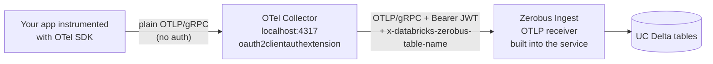

# How Zerobus's Server Actually Works

> Reverse‑engineered from the open‑source Zerobus SDK, official Databricks/Microsoft Learn documentation, public GitHub issues/PRs, and a third‑party integration in [vectordotdev/vector](https://github.com/vectordotdev/vector). Every claim is footnoted.

---

## AI summary

Zerobus is not Spark Connect, not an OTel Collector, not Kafka. It's a proprietary Databricks gRPC microservice exposing 3 protocol surfaces on one DNS 
endpoint (<workspace>.zerobus.<region>.cloud.databricks.com / azuredatabricks.net):

 1. Custom gRPC SDK — databricks.zerobus.Zerobus / EphemeralStream (proto2 bidi streaming, cumulative-offset durability ACKs).
 2. REST — POST /zerobus/v1/tables/{cat}.{sch}.{tbl}/insert, JSON, 10K rps cap.
 3. Native OTLP/gRPC — registers the canonical opentelemetry.proto.collector.{trace,logs,metrics}.v1.*Service/Export paths directly inside the Zerobus 
service. Routing key: x-databricks-zerobus-table-name header.

The OTLP support is native, not a proxy — Databricks docs say so verbatim: "a native OpenTelemetry Protocol (OTLP) endpoint built into the Zerobus Ingest
 service." The OTel Collector only appears in their guidance as a client-side sidecar for OAuth token refresh (since
Databricks tokens expire hourly).

databricks/containers is unrelated — it's just reference Dockerfiles for custom DBR cluster images (Ubuntu, GPU, R, conda variants). Zero OTel content.

The server's job: validate JWT (UC RAR-style scoped to zerobusDirectWriteApi), validate descriptor against the Delta schema, durably buffer (parquet 
staging, with _zerobus/table_rejected_parquets/ fallback), then commit Parquet files + Delta log atomically. Two latency
budgets: P50 200 ms to durability ACK, P50 5 s until queryable.

Notable third-party twist: Vector merged a databricks_zerobus sink (PR #24840) — but it embeds the Zerobus SDK directly, not OTLP. That's why the SDK was
 hardened with the x-zerobus-sdk header.

---

## Executive summary

Zerobus is **not** Spark Connect. It is **not** an OpenTelemetry Collector. It is **not** Kafka, Kinesis, or a hosted Pub/Sub. It is a **purpose‑built, closed‑source, multi‑tenant Databricks ingestion microservice** that:

1. Speaks **its own custom gRPC bidirectional streaming protocol** — `databricks.zerobus.Zerobus / EphemeralStream` — defined in the public proto file shipped with the SDK[^1].
2. Buffers records server‑side, then **writes directly into Unity Catalog managed Delta tables** (no message bus in between — hence "**zero bus**")[^2][^3].
3. Exposes **three protocol surfaces on one DNS endpoint** (`<workspace-id>.zerobus.<region>.cloud.databricks.com` / `…azuredatabricks.net`): the custom gRPC SDK protocol, a REST endpoint, and a **native OTLP/gRPC** receiver that implements the standard `opentelemetry.proto.collector.*.v1.*Service/Export` paths[^4][^5][^6].
4. The **OTLP support is "native" — built into the Zerobus service itself**, not a separately deployed OpenTelemetry Collector. An OTel Collector only appears in Databricks' guidance as a **client‑side proxy** for OAuth token refresh[^4][^7].
5. The repo `databricks/containers` is **completely unrelated** — it contains Dockerfile examples for custom Databricks Runtime cluster images (Ubuntu base, R, GPU, conda, etc.), not OTel Collectors and not Zerobus[^8].

Confidence on the public‑facing protocol contract is very high (the proto, OAuth flow, headers, error codes, and OTLP service paths are all in source we can read). Confidence on the **server's internal write path to Delta** is medium — the docs describe responsibilities ("buffer → durability ack → materialize to Delta") but the implementation language and storage layout of the buffer are not publicly documented.

---

## 1. The big picture: one endpoint, three protocol surfaces, one storage backend

```mermaid
flowchart LR
    subgraph Clients["Client side"]
        A1[Zerobus SDK<br/>Rust/Python/TS/Java/Go]
        A2[Any HTTPS client<br/>edge/IoT device]
        A3[Any OTLP exporter<br/>OTel SDK / OTel Collector / Vector]
    end

    subgraph Edge["Workspace endpoint<br/>&lt;workspace-id&gt;.zerobus.&lt;region&gt;.&lt;cloud&gt;:443<br/>HTTP/2 + TLS"]
        direction TB
        E1["gRPC service<br/>databricks.zerobus.Zerobus<br/>EphemeralStream (bidi)"]
        E2["REST endpoint<br/>POST /zerobus/v1/tables/&#123;cat&#125;.&#123;sch&#125;.&#123;tbl&#125;/insert"]
        E3["OTLP/gRPC services<br/>opentelemetry.proto.collector.trace.v1.TraceService/Export<br/>...logs.v1.LogsService/Export<br/>...metrics.v1.MetricsService/Export"]
        E4["Arrow Flight DoPut<br/>arrow.flight.protocol.FlightService/DoPut<br/>(experimental, not GA on server)"]
    end

    subgraph Server["Zerobus Ingest service (proprietary, serverless)"]
        S1[OAuth/JWT validation<br/>Unity Catalog privilege check]
        S2[Schema validation<br/>vs. Delta table schema]
        S3[Durability buffer<br/>cumulative offset ACK]
        S4[Delta writer<br/>Parquet files + Delta log commit]
        S5[Fallback path:<br/>_zerobus/table_rejected_parquets/]
    end

    subgraph Storage["Unity Catalog managed Delta tables"]
        D1[(catalog.schema.table)]
    end

    A1 -- custom gRPC + Bearer JWT --> E1
    A2 -- HTTPS POST + Bearer JWT --> E2
    A3 -- OTLP/gRPC + Bearer JWT --> E3
    A1 -. experimental .-> E4

    E1 --> S1
    E2 --> S1
    E3 --> S1
    E4 --> S1
    S1 --> S2 --> S3 --> S4 --> D1
    S3 -. on breaking schema change .-> S5
```



The endpoint URL is **per‑workspace, per‑region**[^9][^10]:

| Cloud | Pattern |
|---|---|
| AWS | `https://<workspace-id>.zerobus.<region>.cloud.databricks.com` |
| Azure | `https://<workspace-id>.zerobus.<region>.azuredatabricks.net` |

The workspace ID is the first DNS label and is the routing key for the server fleet[^9]. Most regions are multi‑zonal; `westus` and `northcentralus` on Azure are documented as single‑AZ[^11].

> *"It is a serverless connector that automatically scales to handle incoming connections. It does not require configuring partitions or managing brokers."*[^2]
>
> *"With Zerobus Ingest, your 'scaling strategy' is to open more connections."*[^2]

That last quote is the giveaway: Zerobus is **not partitioned like Kafka**. There are no shards, no consumer groups, no sequence numbers retained server‑side. Throughput scales by **opening more streams**, not by adding partitions.

---

## 2. Wire protocol #1 — the Zerobus SDK (custom gRPC bidi streaming)

### 2.1 The proto, in full

The wire contract is published in the SDK repo at `rust/sdk/zerobus_service.proto`[^1]. It defines exactly **one** RPC:

```protobuf
syntax = "proto2";
package databricks.zerobus;          // Java: com.databricks.zerobus

service Zerobus {
  rpc EphemeralStream(stream EphemeralStreamRequest)
      returns (stream EphemeralStreamResponse);
}

enum RecordType { RECORD_TYPE_UNSPECIFIED = 0; PROTO = 1; JSON = 2; }

message CreateIngestStreamRequest {
  optional string     table_name       = 1;   // "catalog.schema.table"
  reserved            2;                       // stream_id — NOT SUPPORTED
  optional bytes      descriptor_proto = 3;   // serialized DescriptorProto
  optional RecordType record_type      = 4;   // PROTO or JSON
}
message CreateIngestStreamResponse {
  optional string stream_id = 1;              // server-assigned UUID
  reserved        2;                           // last_offset_id — NOT SUPPORTED
}

message IngestRecordRequest {
  optional int64 offset_id = 1;
  oneof record { bytes proto_encoded_record = 2; string json_record = 3; }
}
message IngestRecordBatchRequest {
  optional int64 offset_id = 1;
  oneof batch { ProtoEncodedRecordBatch proto_encoded_batch = 2;
                JsonRecordBatch         json_batch          = 3; }
}

message IngestRecordResponse {
  optional int64 durability_ack_up_to_offset = 1; // CUMULATIVE high-watermark
}
message CloseStreamSignal {
  optional google.protobuf.Duration duration = 1; // server-initiated graceful close
}

message EphemeralStreamRequest  { oneof payload {
  CreateIngestStreamRequest  create_stream       = 1;
  IngestRecordRequest        ingest_record       = 2;
  IngestRecordBatchRequest   ingest_record_batch = 3;
}}
message EphemeralStreamResponse { oneof payload {
  CreateIngestStreamResponse create_stream_response = 1;
  IngestRecordResponse       ingest_record_response = 2;
  CloseStreamSignal          close_stream_signal    = 3;
}}
```

The proto is marked **`API Stability: STABLE`** and currently `v1`. The next major version is reserved as `databricks.zerobus.v2`[^1]. Two fields (`stream_id` on request, `last_offset_id` on response) are **reserved with the literal comment `NOT SUPPORTED`** — a strong hint that **persistent / resumable streams were designed but never shipped**. Today's streams are *ephemeral* — recovery is entirely a client concern[^1].

### 2.2 The handshake and the ACK model

```mermaid
sequenceDiagram
  autonumber
  participant C as Client (SDK)
  participant S as Zerobus server

  C->>S: HTTP/2 + TLS, open bidi gRPC stream<br/>(metadata: authorization, x-databricks-zerobus-table-name, x-zerobus-sdk)
  C->>S: EphemeralStreamRequest { create_stream { table_name, descriptor_proto, record_type } }
  S-->>C: EphemeralStreamResponse { create_stream_response { stream_id = UUID } }

  loop ingest loop
    C->>S: ingest_record { offset_id = N, proto/json bytes }
    Note over S: Validate against descriptor_proto → buffer → write to Delta files
    S-->>C: ingest_record_response { durability_ack_up_to_offset = M }<br/>(cumulative; one ACK can free many offsets)
  end

  alt server-initiated graceful close
    S-->>C: close_stream_signal { duration }
    Note over C: Pause sends, drain ACKs, reconnect on a new stream
  end
```

The ACK is a **cumulative high‑watermark**, not per‑record: a single `durability_ack_up_to_offset = M` means *all* records with `offset_id ≤ M` are durable[^12]. The receiver task on the client iterates `(last_acked_offset+1)..=M` and unblocks every awaiting future in that range[^12]. This implies the server batches commits internally and amortizes the round‑trip cost across many records.

### 2.3 Headers / gRPC metadata

Three keys are injected on every stream open[^13]:

| Header | Value | Purpose |
|---|---|---|
| `authorization` | `Bearer <JWT>` | OAuth M2M access token (marked sensitive, not logged) |
| `x-databricks-zerobus-table-name` | `<catalog>.<schema>.<table>` | Routing key for the Delta writer |
| `x-zerobus-sdk` | `zerobus-sdk-rs/<version>` (or `-py`, `-java`, `-go`, `-ts`) | SDK identification for server‑side telemetry |

`x-zerobus-sdk` was renamed from `user-agent` in v0.5.0 specifically so platform teams could *track which applications and embedders are sending data through Zerobus*[^14]. PR #268 went further and lets embedders (e.g., Vector) append `callerOrg-<organization>` so the server can distribute traffic by tenant[^15].

### 2.4 Authentication: OAuth 2.0 M2M with Rich Authorization Requests

```http
POST {workspace_url}/oidc/v1/token
Authorization: Basic base64(client_id:client_secret)
Content-Type: application/x-www-form-urlencoded

grant_type=client_credentials&
scope=all-apis&
resource=api://databricks/workspaces/{workspace_id}/zerobusDirectWriteApi&
authorization_details=[
  {"type":"unity_catalog_privileges","privileges":["USE CATALOG"], "object_type":"CATALOG","object_full_path":"<catalog>"},
  {"type":"unity_catalog_privileges","privileges":["USE SCHEMA"],  "object_type":"SCHEMA", "object_full_path":"<catalog>.<schema>"},
  {"type":"unity_catalog_privileges","privileges":["SELECT","MODIFY"],"object_type":"TABLE","object_full_path":"<catalog>.<schema>.<table>"}
]
```

This is **RFC 9396 Rich Authorization Requests (RAR)**: the `authorization_details` parameter pushes fine‑grained Unity Catalog privilege assertions *into the OAuth token request itself*[^16]. The dedicated audience `api://databricks/workspaces/<workspace_id>/zerobusDirectWriteApi` makes the JWT specifically scoped to **Zerobus direct‑write on this workspace**. The server then validates the JWT claims directly without round‑tripping back to UC[^16][^17]. Tokens are fetched fresh on every stream creation (not cached across streams)[^17].

### 2.5 Recovery — entirely client‑side

The client maintains a `LandingZone` with two queues (`queue` of unsent items, `observed_items` of in‑flight items). On a retryable error, `reset_observe()` moves observed items back to the unsent queue and the supervisor opens a fresh `EphemeralStream`, re‑sending everything that wasn't yet ACKed[^18][^19]. The server has no resumption API — the reserved `last_offset_id` field has never been implemented[^1].

Default knobs[^19]:

| Setting | Default | Implication |
|---|---|---|
| `max_inflight_requests` | 1,000,000 | Backpressure semaphore on the client |
| `recovery_retries` | 4 | Max reconnect attempts |
| `recovery_backoff_ms` | 2000 | Fixed‑interval (Issue #192 calls out thundering herd) |
| `recovery_timeout_ms` | 15000 | Per‑attempt deadline |
| `server_lack_of_ack_timeout_ms` | 60000 | If no ACK in 60s, treat the connection as dead |

The 60s no‑ACK timeout tells you the **server is expected to ACK within seconds** under normal conditions, which is consistent with the published "Time to durability P95 ≤ 500 ms"[^11].

### 2.6 Retryable vs. non‑retryable error codes

The SDK uses **standard gRPC status codes** — no Zerobus‑specific error enum[^20]:

| Code | Class | Meaning (server side) |
|---|---|---|
| `INVALID_ARGUMENT` | non‑retryable | Bad descriptor_proto / wrong table name / non‑sequential offset |
| `UNAUTHENTICATED` | non‑retryable | JWT expired / wrong audience |
| `PERMISSION_DENIED` | non‑retryable | Missing UC `MODIFY`/`SELECT` |
| `OUT_OF_RANGE` | non‑retryable | Offset gap detected |
| `NOT_FOUND` | non‑retryable | Table doesn't exist in UC |
| `UNIMPLEMENTED` | non‑retryable | Feature not supported |
| `RESOURCE_EXHAUSTED`, `UNAVAILABLE`, `INTERNAL`, `DEADLINE_EXCEEDED` | retryable | Server overload / transient network |

`RESOURCE_EXHAUSTED` is explicitly mentioned in [issue #236](https://github.com/databricks/zerobus-sdk/issues/236) as a real server response — confirming the server enforces back‑pressure and pushes back on overloaded clients[^21].

### 2.7 Schema model: `DescriptorProto`, not `FileDescriptorSet`

`CreateIngestStreamRequest.descriptor_proto` is a **`prost_types::DescriptorProto` for the single target message**, not a `FileDescriptorSet`[^22]. The Rust SDK ships a `schema` module (added in v1.2.0) that builds this descriptor at runtime from the Unity Catalog `GET /api/2.1/unity-catalog/tables/{name}` REST response, so callers don't have to hand‑write `.proto` files[^22][^23]. The type mapping is documented in `rust/sdk/src/schema.rs`[^22]:

| UC type | Wire (proto2) | Notes |
|---|---|---|
| `STRING`, `VARIANT`, `DECIMAL` | `string` | UTF‑8; `VARIANT` ingested as JSON-encoded string with STRING keys |
| `INT` | `int32` | |
| `LONG` / `BIGINT` | `int64` | |
| `SHORT`/`SMALLINT`/`BYTE`/`TINYINT` | `int32` | range‑checked server‑side |
| `DATE` | `int32` | days since 1970‑01‑01 |
| `TIMESTAMP` | `int64` | µs since 1970‑01‑01 UTC |
| `TIMESTAMP_NTZ` | `int64` | µs, no tz |
| `STRUCT<…>` | nested `message` | |
| `ARRAY<T>` | `repeated T` | no null elements |
| `MAP<K,V>` | synthetic map‑entry `repeated` | K must be integral/bool/string |

Field number = UC `position + 1`, preserving gaps from `DROP COLUMN` under Delta column‑mapping[^22].

### 2.8 Arrow Flight (experimental, not GA on the server)

The SDK also has an experimental Arrow Flight `DoPut` path behind a feature flag[^24]. It connects to **the same `*.zerobus.…` endpoint** but registers the standard `arrow.flight.protocol.FlightService` — only `DoPut` is wired up; everything else (`Handshake`, `ListFlights`, `GetFlightInfo`, `DoGet`, `DoExchange`, `DoAction`, etc.) returns `UNIMPLEMENTED`[^25]. The Python and Java CHANGELOGs explicitly state:

> *"Arrow Flight is not yet supported by default from the Zerobus server side."*[^24]

The handshake sends the Arrow IPC schema as the first `FlightData`, then the server replies with a sentinel `PutResult{ app_metadata: {"ack_up_to_offset": -1, "ack_up_to_records": 0} }` meaning "ready, schema validated"[^26]. Subsequent ACKs carry both an `ack_up_to_offset` (batch high‑watermark) and `ack_up_to_records` (cumulative row count) — i.e., the server can ACK *partial* batches at row granularity[^26]. IPC compression options are `LZ4_FRAME` or `ZSTD`[^26].

---

## 3. Wire protocol #2 — REST endpoint

For "chatty" devices that can't hold a long‑lived stream open, Zerobus exposes a stateless REST endpoint[^27]:

```http
POST <ZEROBUS_ENDPOINT>/zerobus/v1/tables/<catalog>.<schema>.<table>/insert
Authorization: Bearer <token>
Content-Type: application/json

[ {…json record…}, {…}, … ]
```

Throughput cap: **10,000 req/sec**[^11]. The docs explicitly call out the trade‑offs[^27]:

> *"The SDKs with gRPC 'Connection Tax': gRPC specializes in high‑throughput performance through persistent connections. However, every open stream counts against your concurrency quotas."*
>
> *"The REST 'Throughput Tax': REST requires a full handshake for every update, making it stateless."*

So REST and gRPC are **two ways into the same Zerobus service**, with different cost profiles.

---

## 4. Wire protocol #3 — native OTLP/gRPC (the user's main question)

This is the answer to *"They claim OTLP support. How does that work if it's not an OTEL collector?"*

### 4.1 It's native — built into the Zerobus service

Microsoft Learn / Databricks docs are unambiguous[^4]:

> ***"Zerobus Ingest OTLP is a native OpenTelemetry Protocol (OTLP) endpoint built into the Zerobus Ingest service. It lets you push traces, logs, and metrics directly into Unity Catalog Delta tables using standard OpenTelemetry SDKs and collectors, without needing custom libraries."***
>
> ***"Zerobus Ingest OTLP implements the standard OTLP gRPC Collector services as defined by the OpenTelemetry specification. Any OTLP‑compatible exporter (such as OpenTelemetry SDKs, the OpenTelemetry Collector, or other instrumentation libraries) can send data to this endpoint."***

The Zerobus server **registers the canonical OTLP/gRPC service paths verbatim from the OTel spec**[^5]:

| Signal | gRPC service path |
|---|---|
| Traces | `/opentelemetry.proto.collector.trace.v1.TraceService/Export` |
| Logs | `/opentelemetry.proto.collector.logs.v1.LogsService/Export` |
| Metrics | `/opentelemetry.proto.collector.metrics.v1.MetricsService/Export` |

So architecturally there is **no OTel Collector in front of Zerobus**. The Zerobus server *is* the receiver — it's a custom Databricks gRPC service that just happens to **also** speak the OTLP/gRPC `Export` API by registering those service definitions on its own gRPC server. The same TLS endpoint hosts:

- `databricks.zerobus.Zerobus/EphemeralStream` (the SDK),
- `arrow.flight.protocol.FlightService/DoPut` (experimental),
- `opentelemetry.proto.collector.{trace,logs,metrics}.v1.*Service/Export` (OTLP, beta).

### 4.2 Routing: one OTLP gRPC connection → one Delta table

Per the docs[^4][^28]:

> *"Each request targets one table, specified using the `x-databricks-zerobus-table-name` header. To ingest traces, logs, and metrics, configure separate exporters pointing to different tables."*

The same gRPC metadata header used by the SDK (`x-databricks-zerobus-table-name`) carries the fully‑qualified UC table name (e.g., `my_catalog.my_schema.my_prefix_otel_spans`). For traces+logs+metrics you configure **three exporters → three tables**[^4][^28].

### 4.3 The server transforms OTLP messages into a flat Delta row model

This is where the "native" claim earns its keep. Zerobus does non‑trivial server‑side ETL on incoming OTLP[^29]:

> *"When OTLP data arrives, Zerobus Ingest converts each record from the nested OTLP resource/scope/record hierarchy into a flat, denormalized row. Resource attributes and instrumentation scope information are embedded directly in each row, making the data immediately queryable without joins."*

Server‑side transformations[^29]:
1. **Denormalization** — flattens `ResourceSpans → ScopeSpans → Span` (and equivalent for logs/metrics) so each row carries its resource and scope inline.
2. **Augmentation** — adds `record_id` (system‑generated, time‑ordered UUID), `time` (µs since epoch), `date` (partition column), `service_name` (extracted from `resource.attributes["service.name"]`).
3. **ID encoding** — `trace_id` → 32‑char lowercase hex; `span_id`/`parent_span_id` → 16‑char lowercase hex.
4. **Enum encoding** — stored as canonical string names: `SPAN_KIND_SERVER`, `STATUS_CODE_OK`, `AGGREGATION_TEMPORALITY_DELTA`, etc.
5. **VARIANT storage** — every attribute bag (`attributes`, `resource.attributes`, `instrumentation_scope.attributes`, log `body`, metric `metadata`) is stored as Delta `VARIANT` (semi‑structured, type‑preserving JSON; optional Delta variant shredding for query perf in DBR 17.2+).

The DDL Databricks asks you to create yourself for the spans table[^30]:

```sql
CREATE TABLE <catalog>.<schema>.<prefix>_otel_spans (
  record_id STRING, time TIMESTAMP, date DATE, service_name STRING,
  trace_id STRING, span_id STRING, trace_state STRING, parent_span_id STRING,
  flags INT, name STRING, kind STRING,
  start_time_unix_nano LONG, end_time_unix_nano LONG,
  attributes VARIANT, dropped_attributes_count INT,
  events ARRAY<STRUCT<time_unix_nano: LONG, name: STRING, attributes: VARIANT, dropped_attributes_count: INT>>,
  dropped_events_count INT,
  links ARRAY<STRUCT<trace_id: STRING, span_id: STRING, trace_state: STRING, attributes: VARIANT, dropped_attributes_count: INT, flags: INT>>,
  dropped_links_count INT,
  status STRUCT<message: STRING, code: STRING>,
  resource STRUCT<attributes: VARIANT, dropped_attributes_count: INT>,
  resource_schema_url STRING,
  instrumentation_scope STRUCT<name: STRING, version: STRING, attributes: VARIANT, dropped_attributes_count: INT>,
  span_schema_url STRING
) USING DELTA
CLUSTER BY (time, service_name, trace_id)
TBLPROPERTIES ('otel.schemaVersion' = 'v2', …);
```

The logs/metrics DDLs follow the same pattern (CLUSTER BY `(time, service_name)`)[^30].

### 4.4 Practical limits

| Aspect | Value | Source |
|---|---|---|
| Status | **Beta** ("off by default", no SLA, no production use, engineering support) | [^31][^32] |
| Quota | 10,000 requests / sec (default; raise via Databricks rep) | [^33] |
| Billing | "OpenTelemetry (OTLP) ingestion is in Beta and is not billed at this time." | [^34] |
| Compression | gzip via `grpc-encoding: gzip` header on all three services | [^35] |
| Transport | OTLP/gRPC (Protobuf) only — *"HTTP (Protobuf) is not yet supported."* | [^36] |
| Partial success | Standard OTLP partial-success — `rejected_spans` / `rejected_log_records` / `rejected_data_points` + `error_message` | [^37] |

### 4.5 Where the OTel Collector *does* fit: client‑side for OAuth refresh

Databricks' guidance places the OTel Collector strictly **on the client side**, as a sidecar/proxy that handles OAuth token rotation (Databricks tokens expire after 1 hour)[^7]:

> *"Databricks OAuth tokens expire after one hour. Rather than managing token refresh in your application code, deploy an OpenTelemetry Collector as a proxy between your application and Zerobus Ingest. The Collector uses the `oauth2clientauthextension` to mint a token from your service principal credentials at startup and refresh it automatically before expiry."*
>
> *"The Collector sits between your application and Zerobus Ingest. Your application sends plain OTLP to the Collector on `localhost:4317` with no authentication. The Collector adds the OAuth token and table header to each request and forwards it to the Zerobus Ingest endpoint."*



So when Databricks docs say "Collector," they mean a **client‑side OTel Collector binary that you run** — not "we have an OTel Collector running inside Databricks." There is **no OTel Collector inside Databricks' server fleet**.

---

## 5. The server's job, in plain English

Per the official overview[^2]:

> *"The service responsibilities include:*
> *— Schema validation of the message to the table.*
> *— Materializing the data in a timely manner in the target table.*
> *— Sending an acknowledgement to the client that the data is durable."*

And the buffer step[^2]:

> *"The Zerobus Ingest buffers transmit data before adding it to a Delta table. This buffering creates an efficient and durable ingestion mechanism that supports a high volume of clients with variable throughput."*

The **two‑step latency model** the docs publish makes this very clear[^11]:

| Metric | Meaning | P50 | P95 |
|---|---|---|---|
| **Time to durability** | Round‑trip until the client gets `durability_ack_up_to_offset`. Data is safe but **not yet visible** to readers. | ≤ 200 ms | ≤ 500 ms |
| **Time to table** | End‑to‑end until the row is queryable in the Delta table (Parquet file written + Delta log committed). | ≤ 5 s | ≤ 30 s |

So the server's internal pipeline is roughly:

```
gRPC frame → auth/UC privilege check → schema validation against table descriptor →
    durable buffer (this is where "durability" ack is signed) →
    batched write of Parquet files → atomic Delta log commit → row visible to readers.
```

The **fallback path for breaking schema changes** confirms the buffer hits cloud object storage before the Delta commit[^2]:

> *"If a breaking change is made to your target table after Zerobus Ingest makes your data durable before Zerobus Ingest has a chance to publish (push file to storage), the connector will make the data available in a separate folder within your table's storage location."*

That folder is `_zerobus/table_rejected_parquets/` under the table's physical root — i.e., parquet files governed by the same UC access control as the table[^2]. The presence of this fallback strongly implies the durability buffer is itself **object‑storage‑backed Parquet staging**, not just an in‑memory replicated queue. Databricks does not document the buffer's internals further.

### 5.1 Storage constraints (server‑imposed)

- Only **Unity Catalog managed Delta tables** — no external tables, no default storage[^11].
- Table/column names must be ASCII letters, digits, underscores[^11].
- **No automatic schema evolution** — *"Zerobus Ingest will never auto‑evolve your target table."* Adding a new nullable column is a non‑breaking change (missing fields filled with NULL); anything else requires the user to alter the table[^11].
- **At‑least‑once delivery** semantics; per‑stream ordering is preserved[^11].
- Workspaces with FedRAMP / HIPAA / PCI‑DSS compliance profile are **not supported** today[^11].
- Per‑message size cap: **10 MiB** (10,485,760 bytes); the SDK currently caps client‑side at 4 MiB which is a known gap (issue #148)[^38].

### 5.2 Throughput / quotas

| Surface | Limit |
|---|---|
| gRPC (SDK) | 100 MB/sec per stream; 15,000 records/sec per stream; 10 GB/sec per target table[^11] |
| REST | 10,000 req/sec[^11] |
| OTLP/gRPC | 10,000 req/sec (default; raise via rep)[^33] |
| Partitioned tables | ≤ 1,000 partitions touched per 5‑sec window[^11] |
| Max Protobuf columns | 2,000[^11] |

Geographic co‑location of producer and endpoint is required to hit the published throughput[^11].

### 5.3 Observability — the system tables

Server‑side observability is exposed to customers via two system tables in `system.lakeflow`[^39]:

- **`system.lakeflow.zerobus_stream`** — stream lifecycle: `stream_id`, `event_time`, `opened_time`, `closed_time`, `table_id`, `table_name`, `protocol` (`GRPC` / `HTTP`), `data_format` (`PROTOBUF` / `JSON`), `errors[]`. Note: no `OTLP` value documented for `protocol`, suggesting OTLP traffic shows up as `GRPC`.
- **`system.lakeflow.zerobus_ingest`** — per‑Delta‑commit aggregates: `commit_version` (Delta log version), `committed_records`, `committed_bytes`, `tags` (always `["DIRECT_WRITE"]`).

Both have 365‑day retention and support streaming queries.

### 5.4 Billing

Billing surface[^40]:
- Azure SKU: **Automated Serverless**; AWS SKU: **Jobs Serverless**.
- Filter: `billing_origin_product = 'LAKEFLOW_CONNECT'`, `product_features.lakeflow_connect.zerobus_request_type = 'GRPC' | 'HTTP'`.
- **OTLP is currently not billed (Beta)**[^34].

### 5.5 Product family

Zerobus sits inside the **Lakeflow Connect** product umbrella — but it is **architecturally separate** from the **Lakeflow Spark Declarative Pipelines (LDP, formerly DLT)** managed connectors. The DLT‑backed managed connectors run *Spark* under the hood; Zerobus does **not**[^41]. The two are billed under the same `LAKEFLOW_CONNECT` family but they are different services that just happen to share branding.

---

## 6. What Zerobus is *not*

### 6.1 Not Spark Connect

Spark Connect appears **nowhere** in the Zerobus public surface area:
- Zero hits in the SDK source for "Spark Connect"[^42].
- Zero mentions in the official docs.
- Zerobus has its own gRPC service (`databricks.zerobus.Zerobus`) — not `org.sparkproject.connect.proto.SparkConnectService`.
- The "Spark/Delta `StructField`" comment in `schema.rs` is the only allusion to Spark, and it's a **semantic** reference (matching nullable defaults), not a wire‑level dependency[^22].

### 6.2 Not an OpenTelemetry Collector

- No `otel-collector-config.yaml`, no `receivers/exporters/pipelines:` configs anywhere in any public Databricks repo[^8][^43].
- Zero OpenTelemetry crates in `rust/sdk/Cargo.toml`[^44]. The 60 hits for "opentelemetry" in `databricks-sdk-go` are all in the `NOTICE` file (third‑party license attribution from gRPC‑go's transitive deps) — none are usage[^43].
- The Zerobus SDK's only telemetry is the Rust `tracing` crate (structured logging facade) — completely different from OpenTelemetry. No spans/traceparent are propagated on outgoing gRPC metadata[^45].
- Even the Go SDK's `go.opentelemetry.io/*` lines in `go/tests/go.sum` are transitive deps of `google.golang.org/grpc` v1.78.0 — not actively used by Zerobus[^45].

### 6.3 Not Kafka / Kinesis / Pub-Sub

> *"It is a serverless connector that automatically scales to handle incoming connections. It does not require configuring partitions or managing brokers."*[^2]

No partitions, no consumer groups, no shards, no broker‑side retention. The reserved (and never shipped) `stream_id`/`last_offset_id` fields show that Databricks *considered* persistent server‑side streams and chose not to ship them[^1]. The "**zero bus**" name is most parsimoniously read as **zero message bus** — point‑to‑point ingest with no intermediate broker[^46].

### 6.4 What `databricks/containers` actually contains

The user specifically asked. Verbatim from the README[^8]:

> *"This repository provides Dockerfiles for use with Databricks Container Services. These Dockerfiles are meant as a reference and a starting point."*

Tree:

```
databricks/containers/
├── LICENSE
├── README.md
├── experimental/{alpine, ubuntu}/
└── ubuntu/{R, blackice, dbfsfuse, gpu, minimal, python, python-conda, ssh, standard}/
```

It's reference Dockerfiles for **custom Databricks Runtime cluster images** (GPU clusters, R, Python, conda variants, plus an internal `blackice` compute variant). Searching its content for `otel`, `otlp`, `opentelemetry`, `zerobus`, `collector`, `ingest` returned **zero hits**[^8][^43]. It is unrelated to Zerobus and unrelated to OpenTelemetry.

### 6.5 No public Databricks `.proto` for Zerobus outside the SDK

GitHub‑wide searches `path:*.proto zerobus`, `ZerobusIngestionService`, and `org:databricks "OTLP"` (excluding the NOTICE‑file noise) returned **0 hits**[^43]. The SDK's `zerobus_service.proto` is the *only* public spec.

---

## 7. The Vector twist — third‑party SDK‑based integration

A genuinely interesting find: **[vectordotdev/vector](https://github.com/vectordotdev/vector)** merged a `databricks_zerobus` sink in PR #24840[^47]. Crucially, **it does not use OTLP** — it embeds the Zerobus SDK directly:

> *"Databricks provides a Zerobus ingest connector, a push based API that writes data directly into Unity Catalog Delta tables. This PR introduces a new vector sink that integrates with Databricks, allowing Vector to push data into Databricks. We use the Databricks provided SDK to implement the sink."*[^47]
>
> *"Users do not have to specify the schema at all, we will fetch the schema for them from Unity Catalog and then use on the API."*[^47]

Vector's sink is **logs only**, OAuth‑authenticated, uses protobuf row encoding via the SDK's runtime descriptor builder, and connects to the same `*.zerobus.…` endpoint[^47]. This is also why the Zerobus SDK PR #268 specifically hardened the `x-zerobus-sdk` header — to identify Vector traffic on the server side[^15].

Two relevant observations:

1. The Zerobus SDK PR mentioning "internal services written in Rust will use RAF (Rust Application Framework) … analogous to how Scala services use Armeria's `GrpcChannel`"[^48] strongly hints that Databricks' internal control‑plane services use **Scala/Armeria** (and increasingly Rust); the Zerobus server is plausibly a Scala/Armeria service, but this is **not confirmed publicly**.
2. Other observability collectors (Fluent Bit, Datadog Agent) have **no documented Zerobus integration today**[^49].

---

## 8. Key repositories summary

| Repository | Status | Purpose | Relevant to Zerobus server? |
|---|---|---|---|
| [databricks/zerobus-sdk](https://github.com/databricks/zerobus-sdk) | Active GA | Polyglot SDK monorepo (Rust core + FFI for Py/Java/Go/TS) | Yes — defines wire contract |
| [databricks/zerobus-sdk-py](https://github.com/databricks/zerobus-sdk-py) | Archived | Legacy standalone Python | No — superseded |
| [databricks/zerobus-sdk-java](https://github.com/databricks/zerobus-sdk-java) | Archived | Legacy standalone Java | No — superseded |
| [databricks/zerobus-sdk-go](https://github.com/databricks/zerobus-sdk-go) | Archived | Legacy standalone Go | No — superseded |
| [databricks/zerobus-sdk-ts](https://github.com/databricks/zerobus-sdk-ts) | Archived | Legacy standalone TS | No — superseded |
| [databricks/containers](https://github.com/databricks/containers) | Active | DBR custom cluster Dockerfiles | **No — unrelated** |
| [databricks/tmm](https://github.com/databricks/tmm) | Demo | Includes a `Zerostream/docs/ZEROBUS_SETUP_GUIDE.md` referencing an older `/api/2.0/unity-catalog/.../streaming/ingest` URL — pre‑GA demo | Tangential — older internal demo |
| [vectordotdev/vector](https://github.com/vectordotdev/vector) | 3rd‑party | `databricks_zerobus` sink (logs) | Confirms SDK is the integration path, not OTLP |

**No Zerobus server source code is publicly available**, in any form, anywhere[^43]. Only client SDKs are open source (Apache 2.0 from v1.2.0 onward[^50]).

---

## 9. Confidence assessment

| Claim | Confidence | Why |
|---|---|---|
| Zerobus speaks `databricks.zerobus.Zerobus/EphemeralStream` (custom proto2 bidi gRPC) | **Very high** | Source is in the SDK proto[^1] |
| Endpoint pattern `<workspace-id>.zerobus.<region>.<cloud>:443` | **Very high** | Examples + builder code[^9][^10] |
| OAuth M2M with RAR + `zerobusDirectWriteApi` audience | **Very high** | Token factory source[^16][^17] |
| Three required gRPC metadata headers (auth, table-name, sdk‑id) | **Very high** | Headers provider source[^13] |
| Cumulative `durability_ack_up_to_offset` ACK semantics | **Very high** | Proto + receiver task[^1][^12] |
| OTLP support is **native** (built into Zerobus, not a sidecar OTel Collector) | **High** | Direct quote from Databricks docs[^4] |
| OTLP service paths are the canonical OTel ones | **Very high** | Docs[^5] |
| Beta status, 10K rps, gzip on, OTLP/HTTP unsupported, partial-success on | **Very high** | Docs[^31][^33][^35][^36][^37] |
| Server transforms OTLP into flat denormalized rows + VARIANT attributes | **High** | Docs[^29][^30] |
| Buffer→Parquet→Delta‑commit pipeline; fallback at `_zerobus/table_rejected_parquets/` | **High** | Docs[^2] |
| Latency budgets (P50 200 ms / 5 s; P95 500 ms / 30 s) | **High** | Docs[^11] |
| Throughput caps and at‑least‑once delivery | **High** | Docs[^11] |
| `databricks/containers` is unrelated to Zerobus / OTel | **Very high** | Repo content[^8] |
| **Server implementation language** (Scala/Armeria? Rust/RAF?) | **Low** | Inferred from issue #146 wording[^48], not confirmed |
| **Buffer's internal storage** (object‑storage‑backed Parquet staging? in‑memory replicated?) | **Medium** | Inferred from fallback path naming[^2], not confirmed |
| **Whether OTLP and SDK protocols share one binary or two** behind the same DNS | **Low** | Same hostname is documented[^4]; same process is plausible but not stated |

### Open questions worth follow‑up
1. The internal language and framework of the Zerobus server. Strong hint that Databricks internals are Scala/Armeria + Rust/RAF, but no public statement names the Zerobus stack[^48].
2. Whether the durability buffer is object‑storage‑backed Parquet staging (most likely, given the fallback folder location) or a separate replicated WAL.
3. Whether Arrow Flight will GA. The CHANGELOGs say it's not server‑supported by default today[^24]; the proto and SDK are ready.
4. Whether persistent / resumable `EphemeralStream` will ship — the reserved `stream_id` and `last_offset_id` fields suggest it was on the roadmap and may return in `databricks.zerobus.v2`[^1].
5. Why `OTLP` is not (yet) a documented `protocol` value in `system.lakeflow.zerobus_stream` — likely because OTLP traffic is logged as `GRPC` while in Beta[^39].

---

## Footnotes

[^1]: Proto definition — `rust/sdk/zerobus_service.proto:1-223` (proto2; package `databricks.zerobus`; service `Zerobus`; single RPC `EphemeralStream`; reserved fields `stream_id` and `last_offset_id` marked "NOT SUPPORTED"). Mirror copies in `java/src/main/proto/zerobus_service.proto` and `go/tests/zerobus_service.proto`. See [databricks/zerobus-sdk](https://github.com/databricks/zerobus-sdk).

[^2]: [learn.microsoft.com/azure/databricks/ingestion/zerobus-overview](https://learn.microsoft.com/en-us/azure/databricks/ingestion/zerobus-overview) — service responsibilities (schema validation / materialization / durability ack), serverless scale model, "buffers transmit data before adding it to a Delta table", `_zerobus/table_rejected_parquets/` fallback path.

[^3]: SDK README — *"Zerobus is a high-throughput streaming service for direct data ingestion into Databricks Delta tables."* See [databricks/zerobus-sdk](https://github.com/databricks/zerobus-sdk).

[^4]: [learn.microsoft.com/azure/databricks/ingestion/opentelemetry/](https://learn.microsoft.com/en-us/azure/databricks/ingestion/opentelemetry/) — *"Zerobus Ingest OTLP is a native OpenTelemetry Protocol (OTLP) endpoint built into the Zerobus Ingest service."* AWS mirror at `docs.databricks.com/aws/en/ingestion/opentelemetry/` is identical.

[^5]: [learn.microsoft.com/azure/databricks/ingestion/opentelemetry/](https://learn.microsoft.com/en-us/azure/databricks/ingestion/opentelemetry/) — Supported signals table listing the three OTLP gRPC service paths verbatim.

[^6]: [learn.microsoft.com/azure/databricks/ingestion/zerobus-ingest](https://learn.microsoft.com/en-us/azure/databricks/ingestion/zerobus-ingest) — *"Zerobus Ingest supports gRPC, REST, and OpenTelemetry (OTLP) interfaces."*

[^7]: [learn.microsoft.com/azure/databricks/ingestion/opentelemetry/configure](https://learn.microsoft.com/en-us/azure/databricks/ingestion/opentelemetry/configure) — Section "OpenTelemetry Collector with automatic token refresh"; quotes about Collector sitting on `localhost:4317` and `oauth2clientauthextension`.

[^8]: [databricks/containers/README.md](https://github.com/databricks/containers/blob/a72b03b10a837752e5f9ec3f1057b079e4454473/README.md) — *"This repository provides Dockerfiles for use with Databricks Container Services."* Directory tree contains only `experimental/{alpine,ubuntu}/` and `ubuntu/{R, blackice, dbfsfuse, gpu, minimal, python, python-conda, ssh, standard}/`. Repo‑wide search for `otel|otlp|opentelemetry|zerobus|collector|ingest` returned zero hits.

[^9]: Workspace-ID extraction from the endpoint hostname — `rust/sdk/src/builder/sdk_builder.rs:110-119`. Test asserts `https://my-workspace.zerobus.us-east-1.cloud.databricks.com` → `workspace_id = "my-workspace"`. See [databricks/zerobus-sdk](https://github.com/databricks/zerobus-sdk).

[^10]: Endpoint URL examples — `rust/examples/proto/single/src/main.rs:22-27` (AWS + Azure variants). Go README at `go/README.md`. See [databricks/zerobus-sdk](https://github.com/databricks/zerobus-sdk).

[^11]: [learn.microsoft.com/azure/databricks/ingestion/zerobus-limits](https://learn.microsoft.com/en-us/azure/databricks/ingestion/zerobus-limits) — multi-zonal vs `westus`/`northcentralus` single-AZ; latency budgets P50 ≤ 200 ms / P95 ≤ 500 ms (durability) and P50 ≤ 5 s / P95 ≤ 30 s (table); throughput 100 MB/s per stream / 15K rec/s per stream / 10 GB/s per table; REST 10K rps; max record 10 MB; managed Delta only; no auto schema evolution; at-least-once; FedRAMP/HIPAA/PCI-DSS not supported; 1,000 partitions per 5-sec window; ≤ 2,000 protobuf columns.

[^12]: Cumulative ACK draining — `rust/sdk/src/lib.rs:1756-1794` (receiver task loops `(last_acked_offset+1)..=durability_ack_up_to_offset` and unblocks oneshots in that range). Logical vs physical offset distinction at `lib.rs:1884-1898`. See [databricks/zerobus-sdk](https://github.com/databricks/zerobus-sdk).

[^13]: gRPC metadata headers — `rust/sdk/src/headers_provider.rs:80-95` (`authorization`, `x-databricks-zerobus-table-name`, `x-zerobus-sdk`); applied at `rust/sdk/src/lib.rs:1231-1255` with `auth_value.set_sensitive(true)`. See [databricks/zerobus-sdk](https://github.com/databricks/zerobus-sdk).

[^14]: rust CHANGELOG.md v0.5.0 — *"SDK Identifier Header: Renamed `user-agent` header to `x-zerobus-sdk` for clearer SDK identification in gRPC metadata."* See [databricks/zerobus-sdk](https://github.com/databricks/zerobus-sdk).

[^15]: PR #268 — adds `callerOrg` suffix to `x-zerobus-sdk` so embedders like Vector can identify themselves in server-side telemetry. See [databricks/zerobus-sdk#268](https://github.com/databricks/zerobus-sdk/pull/268).

[^16]: OAuth flow — `rust/sdk/src/default_token_factory.rs:41-85`. `POST {uc_endpoint}/oidc/v1/token`; HTTP Basic with `client_id:client_secret`; form params `grant_type=client_credentials`, `scope=all-apis`, `resource=api://databricks/workspaces/{workspace_id}/zerobusDirectWriteApi`, `authorization_details=[…]` (RFC 9396 RAR). See [databricks/zerobus-sdk](https://github.com/databricks/zerobus-sdk).

[^17]: Tokens fetched per stream creation, not cached — `go/README.md` "Authentication Flow" section ("Fresh tokens are fetched automatically on each connection"). See [databricks/zerobus-sdk](https://github.com/databricks/zerobus-sdk).

[^18]: LandingZone observe/reset — `rust/sdk/src/landing_zone.rs:36-183` (dual queue: `queue` + `observed_items`; `reset_observe()` re-queues observed items on reconnect; semaphore-based backpressure). See [databricks/zerobus-sdk](https://github.com/databricks/zerobus-sdk).

[^19]: Recovery configuration defaults — `rust/sdk/src/stream_options.rs:7-24` and `rust/sdk/src/stream_configuration.rs:28-177`. Issue [#192](https://github.com/databricks/zerobus-sdk/issues/192) discusses fixed-interval retry / thundering herd risk. See [databricks/zerobus-sdk](https://github.com/databricks/zerobus-sdk).

[^20]: Retryable-vs-non-retryable status codes — `rust/sdk/src/errors.rs:48-88` (`UNRETRIABLE_STATUS_CODES = [InvalidArgument, Unauthenticated, PermissionDenied, OutOfRange, Unimplemented, NotFound]`). See [databricks/zerobus-sdk](https://github.com/databricks/zerobus-sdk).

[^21]: Issue [#236](https://github.com/databricks/zerobus-sdk/issues/236) — describes `RESOURCE_EXHAUSTED` server response triggering recovery on Arrow Flight path.

[^22]: Schema runtime descriptor builder — `rust/sdk/src/schema.rs:41-120` (UC type → proto2 wire mapping; `position+1` field numbers preserve `DROP COLUMN` gaps). Added in CHANGELOG v1.2.0 as `descriptor_from_uc_columns` / `descriptor_from_uc_schema`. See [databricks/zerobus-sdk](https://github.com/databricks/zerobus-sdk).

[^23]: Dynamic descriptor flow — issue [#240](https://github.com/databricks/zerobus-sdk/issues/240) tracks expanding to all language SDKs; STRUCT/ARRAY/MAP require `type_json` from UC REST `/api/2.1/unity-catalog/tables/{name}`.

[^24]: Arrow Flight not yet server-side — `python/CHANGELOG.md` and `java/CHANGELOG.md` v1.1.0: *"Arrow Flight is not yet supported by default from the Zerobus server side."* `rust/sdk/src/arrow_stream.rs:1-5` header marks the module experimental. See [databricks/zerobus-sdk](https://github.com/databricks/zerobus-sdk).

[^25]: Mock Arrow Flight server implementation — `rust/tests/src/mock_arrow_flight.rs:130-438` — only `do_put` is implemented; `handshake`, `list_flights`, `get_flight_info`, `poll_flight_info`, `get_schema`, `do_get`, `do_exchange`, `do_action`, `list_actions` all return `UNIMPLEMENTED`. See [databricks/zerobus-sdk](https://github.com/databricks/zerobus-sdk).

[^26]: Arrow Flight handshake + JSON `app_metadata` — `rust/sdk/src/arrow_stream.rs:680-749`, `rust/sdk/src/arrow_metadata.rs:21-71` (`FlightBatchMetadata{offset_id}` / `FlightAckMetadata{ack_up_to_offset, ack_up_to_records}`; sentinel `STREAM_READY_OFFSET = -1`). IPC compression in `arrow_configuration.rs:91-97`. See [databricks/zerobus-sdk](https://github.com/databricks/zerobus-sdk).

[^27]: REST endpoint format and trade-offs — [learn.microsoft.com/azure/databricks/ingestion/zerobus-ingest](https://learn.microsoft.com/en-us/azure/databricks/ingestion/zerobus-ingest) — *"REST 'Throughput Tax': REST requires a full handshake for every update, making it stateless."* and `POST <ZEROBUS_ENDPOINT>/zerobus/v1/tables/<catalog>.<schema>.<table>/insert` form.

[^28]: OTLP routing header — [learn.microsoft.com/azure/databricks/ingestion/opentelemetry/configure](https://learn.microsoft.com/en-us/azure/databricks/ingestion/opentelemetry/configure) — *"All OTLP requests must include the following metadata headers: `x-databricks-zerobus-table-name` … `Authorization` …"*

[^29]: Server-side OTLP transformation — [learn.microsoft.com/azure/databricks/ingestion/opentelemetry/table-reference](https://learn.microsoft.com/en-us/azure/databricks/ingestion/opentelemetry/table-reference) — denormalization of `ResourceSpans → ScopeSpans → Span`, addition of `record_id` / `time` / `date` / `service_name`, hex encoding of `trace_id`/`span_id`, enum-as-string encoding (`SPAN_KIND_SERVER`, etc.), VARIANT storage of attribute bags.

[^30]: OTLP DDL — [learn.microsoft.com/azure/databricks/ingestion/opentelemetry/configure](https://learn.microsoft.com/en-us/azure/databricks/ingestion/opentelemetry/configure) — full `CREATE TABLE … _otel_spans/_otel_logs/_otel_metrics … USING DELTA CLUSTER BY (time, service_name[, trace_id]) TBLPROPERTIES ('otel.schemaVersion' = 'v2', …)`.

[^31]: Beta status — [learn.microsoft.com/azure/databricks/ingestion/opentelemetry/](https://learn.microsoft.com/en-us/azure/databricks/ingestion/opentelemetry/) — *"This feature is in Beta."*

[^32]: Beta definition — [learn.microsoft.com/azure/databricks/release-notes/release-types](https://learn.microsoft.com/en-us/azure/databricks/release-notes/release-types) — *"Beta — Available to most customers. No SLA. No production use. … Beta features are off by default."*

[^33]: OTLP quota — [learn.microsoft.com/azure/databricks/ingestion/opentelemetry/](https://learn.microsoft.com/en-us/azure/databricks/ingestion/opentelemetry/) — *"The default quota is 10,000 requests per second."*

[^34]: OTLP not billed — [learn.microsoft.com/azure/databricks/ingestion/zerobus-overview](https://learn.microsoft.com/en-us/azure/databricks/ingestion/zerobus-overview) — *"OpenTelemetry (OTLP) ingestion is in Beta and is not billed at this time."*

[^35]: gzip — [learn.microsoft.com/azure/databricks/ingestion/opentelemetry/](https://learn.microsoft.com/en-us/azure/databricks/ingestion/opentelemetry/) — *"Gzip compression is supported on all three OTLP services. Set the `grpc-encoding` header to `gzip`."*

[^36]: OTLP/HTTP not supported — [learn.microsoft.com/azure/databricks/ingestion/opentelemetry/](https://learn.microsoft.com/en-us/azure/databricks/ingestion/opentelemetry/) — *"Only the OTLP/gRPC (Protobuf) transport is supported. HTTP (Protobuf) is not yet supported."*

[^37]: Partial success — [learn.microsoft.com/azure/databricks/ingestion/opentelemetry/](https://learn.microsoft.com/en-us/azure/databricks/ingestion/opentelemetry/) — *"Zerobus Ingest OTLP supports partial success as defined by the OTLP specification."*

[^38]: 10 MiB server cap — Issue [#148](https://github.com/databricks/zerobus-sdk/issues/148): *"the Zerobus server currently supports 10MB"*. Aligned with limits doc[^11].

[^39]: System tables — [learn.microsoft.com/azure/databricks/admin/system-tables/zerobus-ingest](https://learn.microsoft.com/en-us/azure/databricks/admin/system-tables/zerobus-ingest) — `system.lakeflow.zerobus_stream` and `system.lakeflow.zerobus_ingest` schemas; `protocol ∈ {GRPC, HTTP}`; `data_format ∈ {PROTOBUF, JSON}`; tags `["DIRECT_WRITE"]`; 365-day retention.

[^40]: Billing — [learn.microsoft.com/azure/databricks/ingestion/zerobus-overview](https://learn.microsoft.com/en-us/azure/databricks/ingestion/zerobus-overview) — Azure SKU "Automated Serverless"; AWS SKU "Jobs Serverless"; `billing_origin_product = 'LAKEFLOW_CONNECT'`.

[^41]: Lakeflow Connect family — [learn.microsoft.com/azure/databricks/ingestion/lakeflow-connect/](https://learn.microsoft.com/en-us/azure/databricks/ingestion/lakeflow-connect/) — managed connectors run on Lakeflow Spark Declarative Pipelines; Zerobus Ingest is its own service in the same family, NOT a DLT source/sink.

[^42]: Repo-wide search of [databricks/zerobus-sdk](https://github.com/databricks/zerobus-sdk) found no occurrences of "Spark Connect"; the only Spark mention is the semantic comparison in `rust/sdk/src/schema.rs:106` ("Defaults to true when absent, matching Spark/Delta `StructField`").

[^43]: GitHub-wide negative searches — `path:*.proto zerobus` (0 results), `ZerobusIngestionService` (0 results), `OTLP org:databricks` repo search (0 results), `opentelemetry org:databricks` code (60 hits all in `databricks-sdk-go` `NOTICE` license attribution file, no usage). [databricks/containers](https://github.com/databricks/containers) repo-wide search for `otel|otlp|opentelemetry|zerobus|collector|ingest` (0 hits).

[^44]: Zero OpenTelemetry crate dependencies in `rust/sdk/Cargo.toml` — only `prost`, `tonic`, `reqwest`, `tokio`, `hyper-http-proxy`, optional `arrow-flight`/`arrow-array`/`arrow-ipc`. See [databricks/zerobus-sdk](https://github.com/databricks/zerobus-sdk).

[^45]: SDK telemetry is `tracing` crate only — `rust/sdk/src/lib.rs:73`, `arrow_stream.rs:26`, `proxy.rs:5,108`, `rust/ffi/src/lib.rs:13,611`, `rust/jni/src/lib.rs:68`. Go SDK `go.opentelemetry.io/*` lines in `go/tests/go.sum:45-56` are transitive deps of `google.golang.org/grpc v1.78.0`. No `traceparent` / Datadog / Zipkin headers injected anywhere. See [databricks/zerobus-sdk](https://github.com/databricks/zerobus-sdk).

[^46]: "Zerobus" naming — no explicit Databricks public statement; inferred from "direct data ingestion" marketing language plus the ephemeral-stream / no-broker design. See SDK README at [databricks/zerobus-sdk](https://github.com/databricks/zerobus-sdk).

[^47]: Vector `databricks_zerobus` sink — [vectordotdev/vector#24840](https://github.com/vectordotdev/vector/pull/24840) (merged 2026-05-06 by `flaviofcruz`). Sink at `src/sinks/databricks_zerobus/{config.rs, error.rs, mod.rs, service.rs, sink.rs, unity_catalog_schema.rs}`. Logs‑only, OAuth, fetches schema from UC REST API, uses Zerobus SDK. Changelog entry at `changelog.d/24840_databricks_zerobus_sink.feature.md`.

[^48]: Issue [#146](https://github.com/databricks/zerobus-sdk/issues/146) — *"In the future when we have internal services written in Rust that want to ingest using Zerobus, they will use RAF (Rust Application Framework) … analogous to how Scala services use Armeria's `GrpcChannel` instead of raw gRPC-Java channels."* Suggests Databricks internals are Scala/Armeria + Rust/RAF.

[^49]: No Fluent Bit, Datadog Agent, or other commercial collectors mentioned in any of the Zerobus / OTLP doc pages on Microsoft Learn or docs.databricks.com (verified via Dispatch 6 fetches of `opentelemetry/`, `opentelemetry/configure`, `opentelemetry/table-reference`).

[^50]: Apache 2.0 license — `rust/CHANGELOG.md` v1.2.0: *"License: Migrated from the Databricks License to the Apache License 2.0."* See [databricks/zerobus-sdk](https://github.com/databricks/zerobus-sdk).
